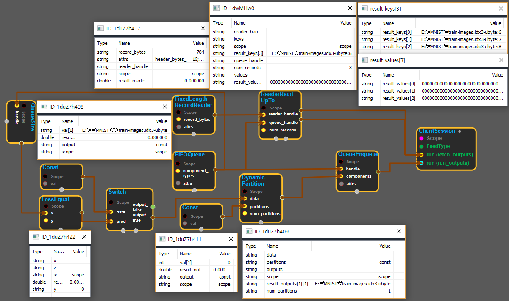

--- 
layout: default 
title: ReaderReadUpTo 
parent: io_ops 
grand_parent: enuSpace-Tensorflow API 
last_modified_date: now 
--- 

# ReaderReadUpTo

---

## tensorflow C++ API

[tensorflow::ops::ReaderReadUpTo](https://www.tensorflow.org/api_docs/cc/class/tensorflow/ops/reader-read-up-to)

Returns up to`num_records`\(key, value\) pairs produced by a Reader.

---

## Summary

Will dequeue from the input queue if necessary \(e.g. when the Reader needs to start reading from a new file since it has finished with the previous file\). It may return less than`num_records`even before the last batch.

Arguments:

* scope: A [Scope](https://www.tensorflow.org/api_docs/cc/class/tensorflow/scope.html#classtensorflow_1_1_scope) object
* reader\_handle: Handle to a Reader.
* queue\_handle: Handle to a Queue, with string work items.
* num\_records: number of records to read from`Reader`

Returns:

* [`Output`](https://www.tensorflow.org/api_docs/cc/class/tensorflow/output.html#classtensorflow_1_1_output): key: A 1-D tensor.
* [`Output`](https://www.gitbook.com/book/expnuni/enuspacetensorflow/edit#): value: A 1-D tensor.

Constructor

* ReaderReadUpTo\(const ::tensorflow::Scope & scope, ::tensorflow::Input reader\_handle, ::tensorflow::Input queue\_handle, ::tensorflow::Input num\_records\) .

Public attributes

* tensorflow::Output keys.
* tensorflow::Output values.

---

## ReaderReadUpTo block

Source link : [https://github.com/EXPNUNI/enuSpace-Tensorflow/blob/master/enuSpaceTensorflow/tf\_io\_ops.cpp](https://github.com/EXPNUNI/enuSpace-Tensorflow/blob/master/enuSpaceTensorflow/tf_io_ops.cpp)

Argument:

* Scope scope : A Scope object \(A scope is generated automatically each page. A scope is not connected.\)
* Input reader\_handle : connect  Input node.
* Input queue\_handle : connect  Input node.
* num\_records _:_ connect  Input node or input num_\__records.

Return:

* Output reader\_handle : Output object of ReaderReadUpTo class object.

Result:

* std::vector\(Tensor\) product\_result : Returned object of executed result by calling session.

---

## Using Method

