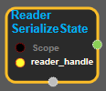
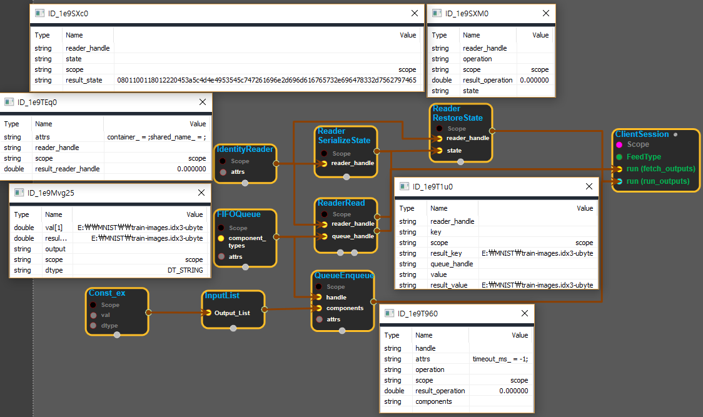

--- 
layout: default 
title: ReaderSerializeState 
parent: io_ops 
grand_parent: enuSpace-Tensorflow API 
last_modified_date: now 
--- 

# ReaderSerializeState

---

## tensorflow C++ API

[tensorflow::ops::ReaderSerializeState](https://www.tensorflow.org/api_docs/cc/class/tensorflow/ops/reader-serialize-state)

Produce a string tensor that encodes the state of a Reader.

---

## Summary

Not all Readers support being serialized, so this can produce an Unimplemented error.

Arguments:

* scope: A Scope object
* reader\_handle: Handle to a Reader.

Returns:

* Output: The state tensor.

Constructor

* ReaderSerializeState\(const ::tensorflow::Scope & scope, ::tensorflow::Input reader\_handle\).

Public attributes

* tensorflow::Output state.

---

## ReaderSerializeState block

Source link : [https://github.com/EXPNUNI/enuSpace-Tensorflow/blob/master/enuSpaceTensorflow/tf\_io\_ops.cpp](https://github.com/EXPNUNI/enuSpace-Tensorflow/blob/master/enuSpaceTensorflow/tf_io_ops.cpp)

Argument:

* Scope scope : A Scope object \(A scope is generated automatically each page. A scope is not connected.\)
* Input reader\_handle : connect  Input node.

Return:

* Output state: Output object of ReaderRestoreState class object.

Result:

* std::vector\(Tensor\) product\_result : Returned object of executed result by calling session.

---

## Using Method

