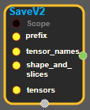
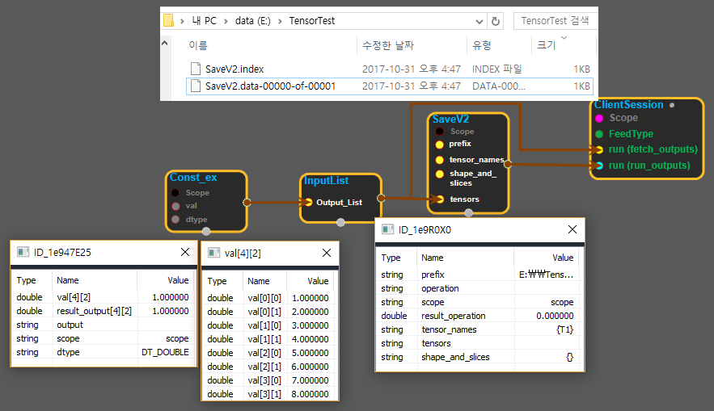

--- 
layout: default 
title: SaveV2 
parent: io_ops 
grand_parent: enuSpace-Tensorflow API 
last_modified_date: now 
--- 

# SaveV2

---

## tensorflow C++ API

[tensorflow::ops::SaveV2](https://www.tensorflow.org/api_docs/cc/class/tensorflow/ops/save-v2)

Saves tensors in V2 checkpoint format.

---

## Summary

By default, saves the named tensors in full. If the caller wishes to save specific slices of full tensors, "shape\_and\_slices" should be non-empty strings and correspondingly well-formed.

Arguments:

* scope: A Scope object
* prefix: Must have a single element. The prefix of the V2 checkpoint to which we write the tensors.
* tensor\_names: shape {N}. The names of the tensors to be saved.
* shape\_and\_slices: shape {N}. The slice specs of the tensors to be saved. Empty strings indicate that they are non-partitioned tensors.
* tensors:`N`tensors to save.

Returns:

* the created Operation.

Constructor

* SaveV2\(const ::tensorflow::Scope & scope, ::tensorflow::Input prefix, ::tensorflow::Input tensor\_names, ::tensorflow::Input shape\_and\_slices, ::tensorflow::InputList tensors\).

Public attributes

* tensorflow::Operation operation.

---

## SaveV2 block

Source link : [https://github.com/EXPNUNI/enuSpaceTensorflow/blob/master/enuSpaceTensorflow/tf\_i\_o\_\_ops.cpp](https://github.com/EXPNUNI/enuSpaceTensorflow/blob/master/enuSpaceTensorflow/tf_io_ops.cpp)

Argument:

* Scope scope : A Scope object \(A scope is generated automatically each page. A scope is not connected.\)
* Input prefix: input prefix with path.
* Input tensor\_names: input tensor\_names.
* InputList  tensors: connect InputList node.

Return:

* Operation operation: Operation operation of SaveV2 class object.  

Result:

* std::vector\(Tensor\) product\_result : Returned object of executed result by calling session.

---

## Using Method

