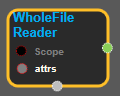
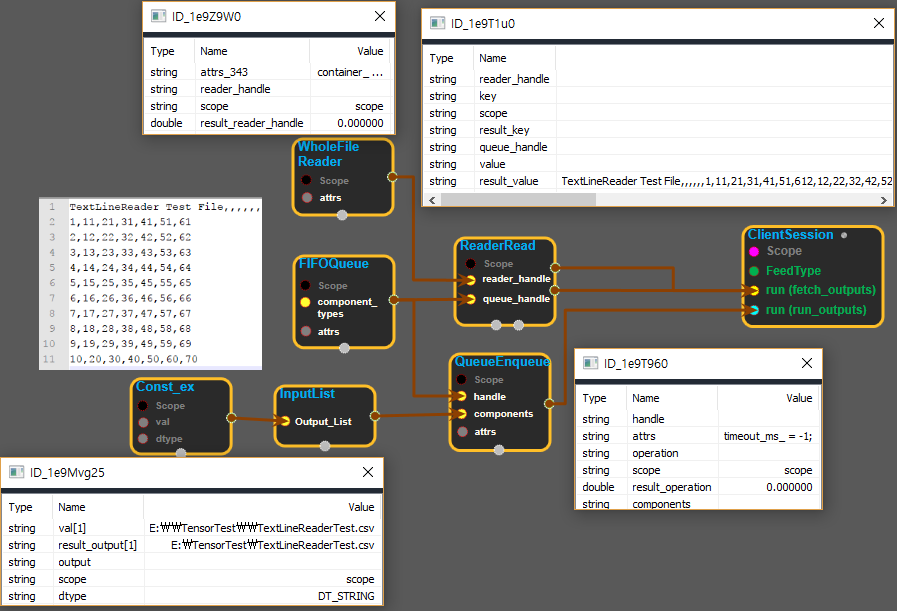

--- 
layout: default 
title: WholeFileReader 
parent: io_ops 
grand_parent: enuSpace-Tensorflow API 
last_modified_date: now 
--- 

# WholeFileReader

---

## tensorflow C++ API

[tensorflow::ops::WholeFileReader](https://www.tensorflow.org/api_docs/cc/class/tensorflow/ops/whole-file-reader)

A Reader that outputs the entire contents of a file as a value.

---

## Summary

To use, enqueue filenames in a Queue. The output of ReaderRead will be a filename \(key\) and the contents of that file \(value\).

Arguments:

* scope: A Scope object

Optional attributes \(see`Attrs`\):

* container: If non-empty, this reader is placed in the given container. Otherwise, a default container is used.
* shared\_name: If non-empty, this reader is named in the given bucket with this shared\_name. Otherwise, the node name is used instead.

Returns:

* [`Output`](https://www.tensorflow.org/api_docs/cc/class/tensorflow/output.html#classtensorflow_1_1_output): The handle to reference the Reader.

Constructor

* WholeFileReader\(const ::tensorflow::Scope & scope, const WholeFileReader::Attrs & attrs\) .

Public attributes

* tensorflow::Output reader\_handle.

---

## WholeFileReader block

Source link : [https://github.com/EXPNUNI/enuSpace-Tensorflow/blob/master/enuSpaceTensorflow/tf\_io\_ops.cpp](https://github.com/EXPNUNI/enuSpace-Tensorflow/blob/master/enuSpaceTensorflow/tf_io_ops.cpp)

Argument:

* Scope scope : A Scope object \(A scope is generated automatically each page. A scope is not connected.\)

* WholeFileReader::Attrs attrs : input option value. ex\)     container\_ = ;  shared\_name\_ = ; 

Return:

* Output reader\_handle : Output object of WholeFileReader class object.

Result:

* std::vector\(Tensor\) product\_result : Returned object of executed result by calling session.

---

## Using Method

