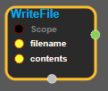
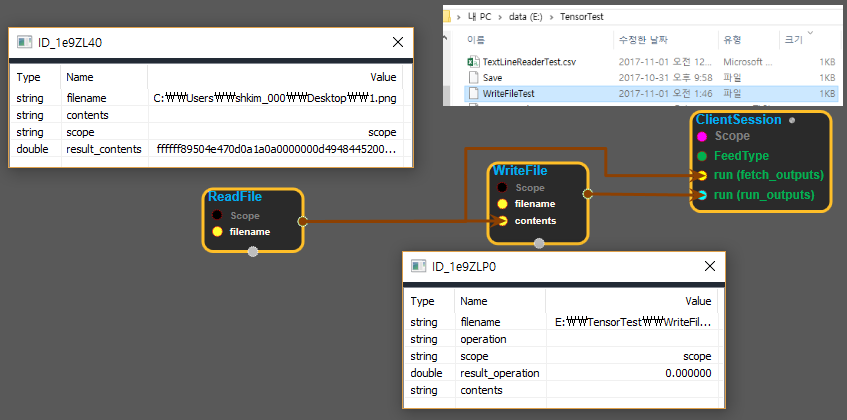

--- 
layout: default 
title: WriteFile 
parent: io_ops 
grand_parent: enuSpace-Tensorflow API 
last_modified_date: now 
--- 

# WriteFile

---

## tensorflow C++ API

[tensorflow::ops::WriteFile](https://www.tensorflow.org/api_docs/cc/class/tensorflow/ops/write-file)

Writes contents to the file at input filename.

---

## Summary

Creates file and recursively

creates directory if not existing.

Arguments:

* scope: A Scope object
* filename: scalar. The name of the file to which we write the contents.
* contents: scalar. The content to be written to the output file.

Returns:

* the created Operation.

Constructor

* WriteFile\(const ::tensorflow::Scope & scope, ::tensorflow::Input filename, ::tensorflow::Input contents\).

Public attributes

* tensorflow::Operation operation.

---

## WriteFile block

Source link : [https://github.com/EXPNUNI/enuSpaceTensorflow/blob/master/enuSpaceTensorflow/tf\_i\_o\_\_ops.cpp](https://github.com/EXPNUNI/enuSpaceTensorflow/blob/master/enuSpaceTensorflow/tf_io_ops.cpp)

Argument:

* Scope scope : A Scope object \(A scope is generated automatically each page. A scope is not connected.\)
* Input filename : input filename with path.
* Input contents: connect input node.

Return:

* Operation operation: Operation operation of WriteFile class object.  

Result:

* std::vector\(Tensor\) product\_result : Returned object of executed result by calling session.

---

## Using Method

