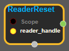
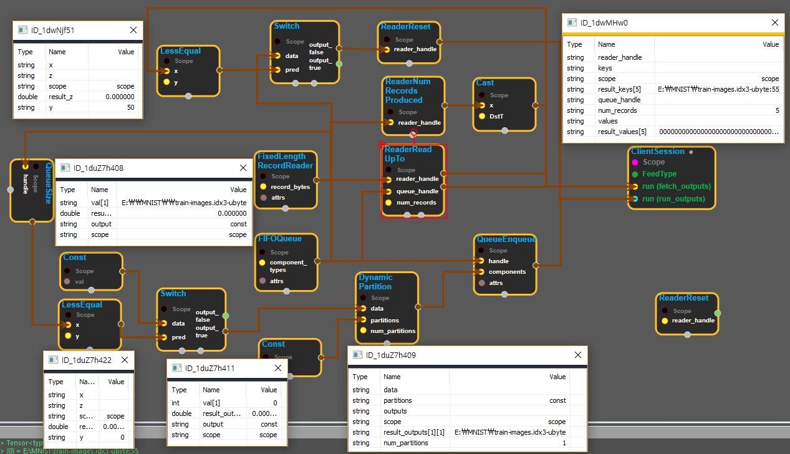

--- 
layout: default 
title: ReaderReset 
parent: io_ops 
grand_parent: enuSpace-Tensorflow API 
last_modified_date: now 
--- 

# ReaderReset

---

## tensorflow C++ API

[tensorflow::ops::ReaderReset](https://www.tensorflow.org/api_docs/cc/class/tensorflow/ops/reader-reset)

Restore a Reader to its initial clean state.

---

## Summary

Arguments:

* scope: A Scope object
* reader\_handle: Handle to a Reader.

Returns:

* the created Operation

Constructor

* ReaderReset\(const ::tensorflow::Scope & scope, ::tensorflow::Input reader\_handle\).

Public attributes

* tensorflow::Operation operation.

---

## ReaderReset block

Source link : [https://github.com/EXPNUNI/enuSpace-Tensorflow/blob/master/enuSpaceTensorflow/tf\_io\_ops.cpp](https://github.com/EXPNUNI/enuSpace-Tensorflow/blob/master/enuSpaceTensorflow/tf_io_ops.cpp)

Argument:

* Scope scope : A Scope object \(A scope is generated automatically each page. A scope is not connected.\)
* Input reader\_handle : connect  Input node.

Return:

* Output operation: Output object of ReaderReset class object.

Result:

* std::vector\(Tensor\) product\_result : Returned object of executed result by calling session.

---

## Using Method

Restore a Reader to FixedLengthRecordReader initial clean state when ReaderNumRecordsProduced is greater then  50.

Actually initial clean state is accomplished in the next step after ReaderReset is enabled. .

ReaderReadUpTo reads 5 records.

