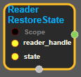

--- 
layout: default 
title: ReaderRestoreState 
parent: io_ops 
grand_parent: enuSpace-Tensorflow API 
last_modified_date: now 
--- 

# ReaderRestoreState

---

## tensorflow C++ API

[tensorflow::ops::ReaderRestoreState](https://www.tensorflow.org/api_docs/cc/class/tensorflow/ops/reader-restore-state)

Restore a reader to a previously saved state.

---

## Summary

Not all Readers support being restored, so this can produce an Unimplemented error.

Arguments:

* scope: A Scope object
* reader\_handle: Handle to a Reader.
* state: Result of a ReaderSerializeState of a Reader with type matching reader\_handle.

Returns:

* the created Operation

Constructor

* ReaderRestoreState\(const ::tensorflow::Scope & scope, ::tensorflow::Input reader\_handle, ::tensorflow::Input state\).

Public attributes

* tensorflow::Operation operation.

---

## ReaderRestoreState block

Source link : [https://github.com/EXPNUNI/enuSpace-Tensorflow/blob/master/enuSpaceTensorflow/tf\_io\_ops.cpp](https://github.com/EXPNUNI/enuSpace-Tensorflow/blob/master/enuSpaceTensorflow/tf_io_ops.cpp)

Argument:

* Scope scope : A Scope object \(A scope is generated automatically each page. A scope is not connected.\)
* Input reader\_handle : connect  Input node.
* Input state : connect  Input node.

Return:

* Operation operation: Output object of ReaderRestoreState class object.

Result:

* std::vector\(Tensor\) product\_result : Returned object of executed result by calling session.

---

## Using Method

