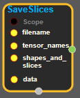
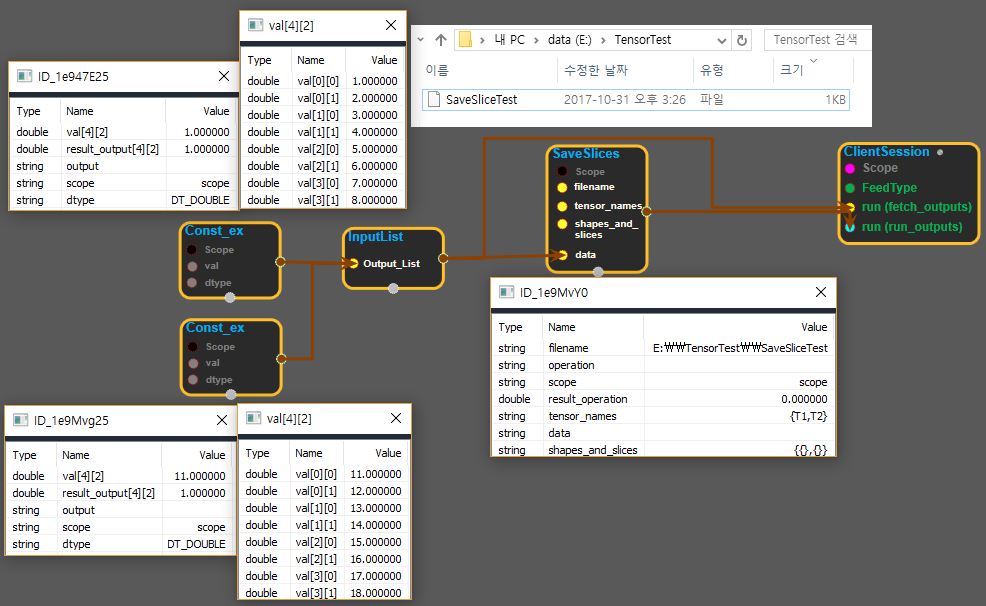

--- 
layout: default 
title: SaveSlices 
parent: io_ops 
grand_parent: enuSpace-Tensorflow API 
last_modified_date: now 
--- 

# SaveSlices

---

## tensorflow C++ API

[tensorflow::ops::SaveSlices](https://www.tensorflow.org/api_docs/cc/class/tensorflow/ops/save-slices)

Saves input tensors slices to disk.

---

## Summary

This is like[`Save`](https://www.tensorflow.org/api_docs/cc/class/tensorflow/ops/save.html#classtensorflow_1_1ops_1_1_save)except that tensors can be listed in the saved file as being a slice of a larger tensor.`shapes_and_slices`specifies the shape of the larger tensor and the slice that this tensor covers.`shapes_and_slices`must have as many elements as`tensor_names`.

Elements of the`shapes_and_slices`input must either be:

* The empty string, in which case the corresponding tensor is saved normally.
* A string of the form`dim0 dim1 ... dimN-1 slice-spec`where the`dimI`are the dimensions of the larger tensor and
  `slice-spec`specifies what part is covered by the tensor to save.

`slice-spec`itself is a`:`-separated list:`slice0:slice1:...:sliceN-1`where each`sliceI`is either:

* The string`-`meaning that the slice covers all indices of this dimension`start,length`
* where`start`and`length`are integers. In that case the slice covers`length`indices starting at`start`.

Arguments:

* scope: A Scope object
* filename: Must have a single element. The name of the file to which we write the tensor.
* tensor\_names: Shape`[N]`. The names of the tensors to be saved.shapes\_and\_slices: [Shape](https://www.tensorflow.org/api_docs/cc/class/tensorflow/ops/shape.html#classtensorflow_1_1ops_1_1_shape)`[N]`. The shapes and slice specifications to use when saving the tensors.
* data:`N`tensors to save.

Returns:

* the created Operation.

Constructor

* SaveSlices\(const ::tensorflow::Scope & scope, ::tensorflow::Input filename, ::tensorflow::Input tensor\_names, ::tensorflow::Input shapes\_and\_slices, ::tensorflow::InputList data\).

Public attributes

* tensorflow::Operation operation.

---

## SaveSlices block

Source link : [https://github.com/EXPNUNI/enuSpaceTensorflow/blob/master/enuSpaceTensorflow/tf\_i\_o\_\_ops.cpp](https://github.com/EXPNUNI/enuSpaceTensorflow/blob/master/enuSpaceTensorflow/tf_io_ops.cpp)

Argument:

* Scope scope : A Scope object \(A scope is generated automatically each page. A scope is not connected.\)
* Input filename : input filename with path.
* Input tensor\_names: input tensor\_names.
* Input  shapes\_and\_slices : input shapes\_and\_slices .
* InputList  data : connect InputList node.

Return:

* Operation operation: Operation operation of SaveSlices class object.  

Result:

* std::vector\(Tensor\) product\_result : Returned object of executed result by calling session.

---

## Using Method

