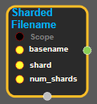
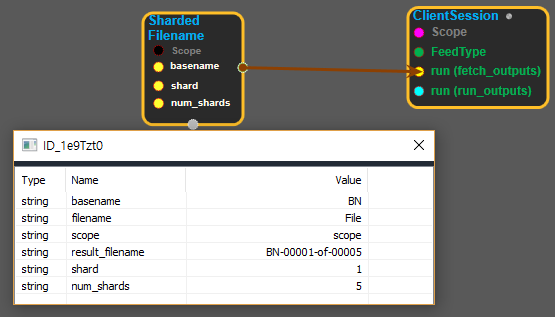

--- 
layout: default 
title: ShardedFilename 
parent: io_ops 
grand_parent: enuSpace-Tensorflow API 
last_modified_date: now 
--- 

# ShardedFilename

---

## tensorflow C++ API

[tensorflow::ops::ShardedFilename](https://www.tensorflow.org/api_docs/cc/class/tensorflow/ops/sharded-filename)

Generate a sharded filename.

---

## Summary

The filename is printf formatted as

s-%05d-of-%05d, basename, shard, num\_shards.

Arguments:

* scope: A Scope object

Returns:

* Output : The filename tensor.

Constructor

* ShardedFilename\(const ::tensorflow::Scope & scope, ::tensorflow::Input basename, ::tensorflow::Input shard, ::tensorflow::Input num\_shards\).

Public attributes

* tensorflow::Output  filename.

---

## ShardedFilename block

Source link : [https://github.com/EXPNUNI/enuSpaceTensorflow/blob/master/enuSpaceTensorflow/tf\_i\_o\_\_ops.cpp](https://github.com/EXPNUNI/enuSpaceTensorflow/blob/master/enuSpaceTensorflow/tf_io_ops.cpp)

Argument:

* Scope scope : A Scope object \(A scope is generated automatically each page. A scope is not connected.\)
* Input basename : input prefix with path.
* Input shard: connect input node or input shard number.
* Input num\_shards: connect input node or input total shard number.

Return:

* Output  filename: Output  filename of ShardedFilename class object.  

Result:

* std::vector\(Tensor\) product\_result : Returned object of executed result by calling session.

---

## Using Method

