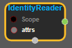
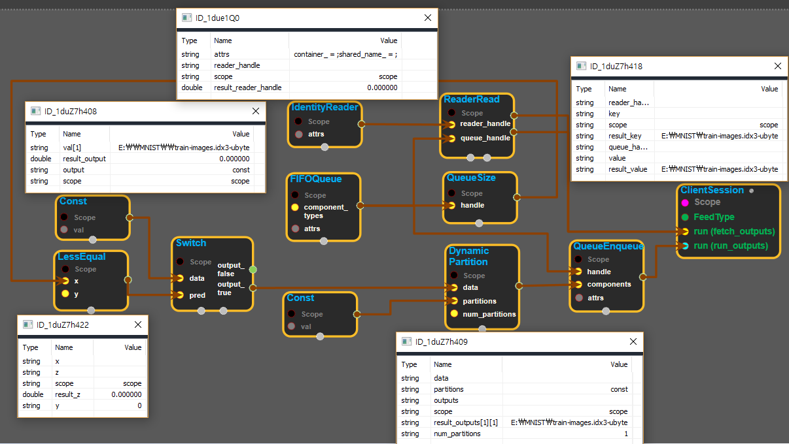

--- 
layout: default 
title: IdentityReader 
parent: io_ops 
grand_parent: enuSpace-Tensorflow API 
last_modified_date: now 
--- 

# IdentityReader

---

## tensorflow C++ API

[tensorflow::ops::IdentityReader](https://www.tensorflow.org/api_docs/cc/class/tensorflow/ops/identity-reader)

A Reader that outputs the queued work as both the key and value.

---

## Summary

To use, enqueue strings in a Queue. [ReaderRead](https://www.tensorflow.org/api_docs/cc/class/tensorflow/ops/reader-read.html#classtensorflow_1_1ops_1_1_reader_read) will take the front work string and output \(work, work\).

Arguments:

* scope: A [Scope](https://www.tensorflow.org/api_docs/cc/class/tensorflow/scope.html#classtensorflow_1_1_scope) object

Optional attributes \(see[`Attrs`](https://www.tensorflow.org/api_docs/cc/struct/tensorflow/ops/fixed-length-record-reader/attrs.html#structtensorflow_1_1ops_1_1_fixed_length_record_reader_1_1_attrs)\):

* container: If non-empty, this reader is placed in the given container. Otherwise, a default container is used.
* shared\_name: If non-empty, this reader is named in the given bucket with this shared\_name. Otherwise, the node name is used instead.

Returns:

* [`Output`](https://www.tensorflow.org/api_docs/cc/class/tensorflow/output.html#classtensorflow_1_1_output): The handle to reference the Reader.

Constructor

* IdentityReader\(const ::tensorflow::Scope & scope, const IdentityReader::Attrs & attrs\) .

Public attributes

* tensorflow::Output reader\_handle.

---

## IdentityReader block

Source link : [https://github.com/EXPNUNI/enuSpace-Tensorflow/blob/master/enuSpaceTensorflow/tf\_io\_ops.cpp](https://github.com/EXPNUNI/enuSpace-Tensorflow/blob/master/enuSpaceTensorflow/tf_io_ops.cpp)

Argument:

* Scope scope : A Scope object \(A scope is generated automatically each page. A scope is not connected.\)
* IdentityReader::Attrs attrs : input option value. ex\) container\_ = "";shared\_name\_ = "";;

Return:

* Output reader\_handle : Output object of IdentityReader class object.

Result:

* std::vector\(Tensor\) product\_result : Returned object of executed result by calling session.

---

## Using Method

