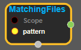
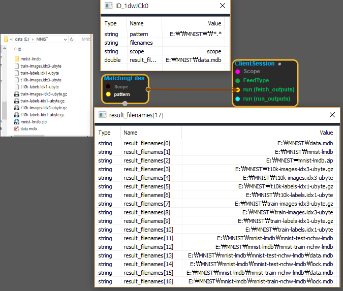

--- 
layout: default 
title: MatchingFiles 
parent: io_ops 
grand_parent: enuSpace-Tensorflow API 
last_modified_date: now 
--- 

# MatchingFiles

---

## tensorflow C++ API

[tensorflow::ops::MatchingFiles](https://www.tensorflow.org/api_docs/cc/class/tensorflow/ops/matching-files)

Returns the set of files matching one or more glob patterns.

---

## Summary

Note that this routine only supports wildcard characters in the basename portion of the pattern, not in the directory portion.

Arguments:

* scope: A [Scope](https://www.tensorflow.org/api_docs/cc/class/tensorflow/scope.html#classtensorflow_1_1_scope) object
* pattern: Shell wildcard pattern\(s\). Scalar or vector of type string.

Returns:

* [`Output`](https://www.tensorflow.org/api_docs/cc/class/tensorflow/output.html#classtensorflow_1_1_output): A vector of matching filenames.

Constructor

* MatchingFiles\(const ::tensorflow::Scope & scope, ::tensorflow::Input pattern\).

Public attributes

* tensorflow::Output filenames.

---

## MatchingFiles block

Source link : [https://github.com/EXPNUNI/enuSpace-Tensorflow/blob/master/enuSpaceTensorflow/tf\_io\_ops.cpp](https://github.com/EXPNUNI/enuSpace-Tensorflow/blob/master/enuSpaceTensorflow/tf_io_ops.cpp)

Argument:

* Scope scope : A Scope object \(A scope is generated automatically each page. A scope is not connected.\)
* Input pattern: connect  Input node or input pattern string. ex\) E:\MNIST\\*.\*

Return:

* Output filenames: Output object of MatchingFiles class object.

Result:

* std::vector\(Tensor\) product\_result : Returned object of executed result by calling session.

---

## Using Method

