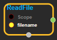
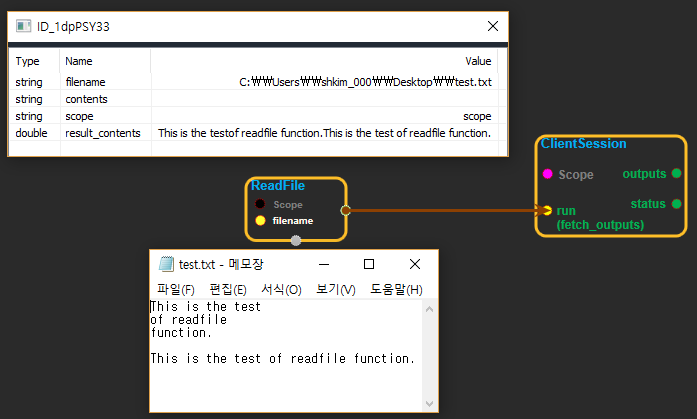

--- 
layout: default 
title: ReadFile 
parent: io_ops 
grand_parent: enuSpace-Tensorflow API 
last_modified_date: now 
--- 

# ReadFile

---

## tensorflow C++ API

[tensorflow::ops::ReadFile](https://www.tensorflow.org/api_docs/cc/class/tensorflow/ops/read-file)

Reads and outputs the entire contents of the input filename.

---

## Summary

Arguments:

* scope: A [Scope](https://www.tensorflow.org/api_docs/cc/class/tensorflow/scope.html#classtensorflow_1_1_scope) object

Returns:

* [`Output`](https://www.tensorflow.org/api_docs/cc/class/tensorflow/output.html#classtensorflow_1_1_output): The contents tensor.

Constructor

* ReadFile\(const ::tensorflow::Scope & scope, ::tensorflow::Input filename\).

Public attributes

* tensorflow::Output contents.

---

## ReadFile block

Source link : [https://github.com/EXPNUNI/enuSpaceTensorflow/blob/master/enuSpaceTensorflow/tf\_i\_o\_\_ops.cpp](https://github.com/EXPNUNI/enuSpaceTensorflow/blob/master/enuSpaceTensorflow/tf_io_ops.cpp)

Argument:

* Scope scope : A Scope object \(A scope is generated automatically each page. A scope is not connected.\)
* Input filename : input filename with path.

Return:

* Output contents : Output object of ReadFile class object. Output datatype is std::string. 

Result:

* std::vector\(Tensor\) product\_result : Returned object of executed result by calling session.

---

## Using Method

