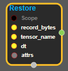
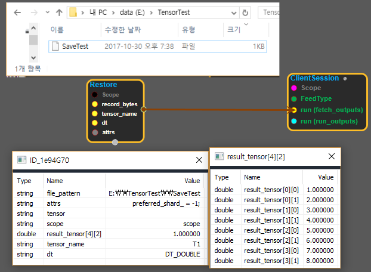

--- 
layout: default 
title: Restore 
parent: io_ops 
grand_parent: enuSpace-Tensorflow API 
last_modified_date: now 
--- 

# Restore

---

## tensorflow C++ API

[tensorflow::ops::Restore](https://www.tensorflow.org/api_docs/cc/class/tensorflow/ops/restore)

Restores a tensor from checkpoint files.

---

## Summary

Reads a tensor stored in one or several files. If there are several files \(for instance because a tensor was saved as slices\),`file_pattern`may contain wildcard symbols \(`*`and`?`\) in the filename portion only, not in the directory portion.

If a`file_pattern`matches several files,`preferred_shard`can be used to hint in which file the requested tensor is likely to be found. This op will first open the file at index`preferred_shard`in the list of matching files and try to restore tensors from that file. Only if some tensors or tensor slices are not found in that first file, then the Op opens all the files. Setting`preferred_shard`to match the value passed as the`shard`input of a matching`Save`Op may speed up Restore. This attribute only affects performance, not correctness. The default value -1 means files are processed in order.

See also`RestoreSlice`.

Arguments:

* scope: A Scope object
* file\_pattern: Must have a single element. The pattern of the files from which we read the tensor.
* tensor\_name: Must have a single element. The name of the tensor to be restored.
* dt: The type of the tensor to be restored..

Optional attributes \(see`Attrs`\):

* preferred\_shard: Index of file to open first if multiple files match`file_pattern`.

Returns:

* Output : The restored tensor.

Constructor

* Restore\(const ::tensorflow::Scope & scope, ::tensorflow::Input file\_pattern, ::tensorflow::Input tensor\_name, DataType dt, const Restore::Attrs & attrs\).

Public attributes

* tensorflow::Output tensor 

---

## Restore block

Source link : [https://github.com/EXPNUNI/enuSpaceTensorflow/blob/master/enuSpaceTensorflow/tf\_i\_o\_\_ops.cpp](https://github.com/EXPNUNI/enuSpaceTensorflow/blob/master/enuSpaceTensorflow/tf_io_ops.cpp)

Argument:

* Scope scope : A Scope object \(A scope is generated automatically each page. A scope is not connected.\)
* Input file\_pattern: input file\_pattern with path.
* Input tensor\_names: input tensor\_name.
* Restore::Attrs attrs : input attrs. ex\) preferred\_shard\_ = -1;

Return:

* Output  tensor : Output  tensor of Restore class object.  

Result:

* std::vector\(Tensor\) product\_result : Returned object of executed result by calling session.

---

## Using Method

