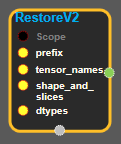
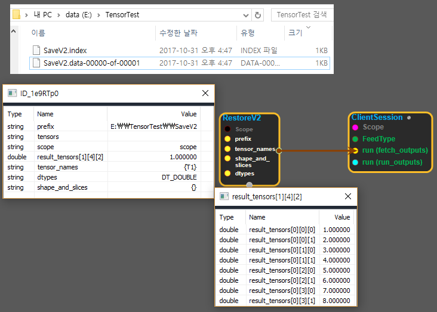

--- 
layout: default 
title: RestoreV2 
parent: io_ops 
grand_parent: enuSpace-Tensorflow API 
last_modified_date: now 
--- 

# RestoreV2

---

## tensorflow C++ API

[tensorflow::ops::RestoreV2](https://www.tensorflow.org/api_docs/cc/class/tensorflow/ops/restore-v2)

Restores tensors from a V2 checkpoint.

---

## Summary

For backward compatibility with the V1 format, this Op currently allows restoring from a V1 checkpoint as well:

* This Op first attempts to find the V2 index file pointed to by "prefix", and if found proceed to read it as a V2 checkpoint;
* Otherwise the V1 read path is invoked. Relying on this behavior is not recommended, as the ability to fall back to read V1 might be deprecated and eventually removed.

By default, restores the named tensors in full. If the caller wishes to restore specific slices of stored tensors, "shape\_and\_slices" should be non-empty strings and correspondingly well-formed.

Callers must ensure all the named tensors are indeed stored in the checkpoint.

Arguments:

* scope: A Scope object
* prefix: Must have a single element. The prefix of a V2 checkpoint.
* tensor\_names: shape {N}. The names of the tensors to be restored.
* shape\_and\_slices: shape {N}. The slice specs of the tensors to be restored. Empty strings indicate that they are non-partitioned tensors.
* dtypes: shape {N}. The list of expected dtype for the tensors. Must match those stored in the checkpoint.

Returns:

* OutputList: shape {N}. The restored tensors, whose shapes are read from the checkpoint directly.

Constructor

* RestoreV2\(const ::tensorflow::Scope & scope, ::tensorflow::Input prefix, ::tensorflow::Input tensor\_names, ::tensorflow::Input shape\_and\_slices, const DataTypeSlice & dtypes\).

Public attributes

* tensorflow::OutputList tensors

---

## RestoreV2 block

Source link : [https://github.com/EXPNUNI/enuSpaceTensorflow/blob/master/enuSpaceTensorflow/tf\_i\_o\_\_ops.cpp](https://github.com/EXPNUNI/enuSpaceTensorflow/blob/master/enuSpaceTensorflow/tf_io_ops.cpp)

Argument:

* Scope scope : A Scope object \(A scope is generated automatically each page. A scope is not connected.\)
* Input prefix: input file\_pattern with path.
* Input tensor\_names: input tensor\_name.
* shape\_and\_slices : input shape\_and\_slices.
* DataTypeSlice dtypes : input DataTypeSlice ;

Return:

* Output  tensor : Output  tensor of Restore class object.  

Result:

* std::vector\(Tensor\) product\_result : Returned object of executed result by calling session.

---

## Using Method

