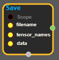
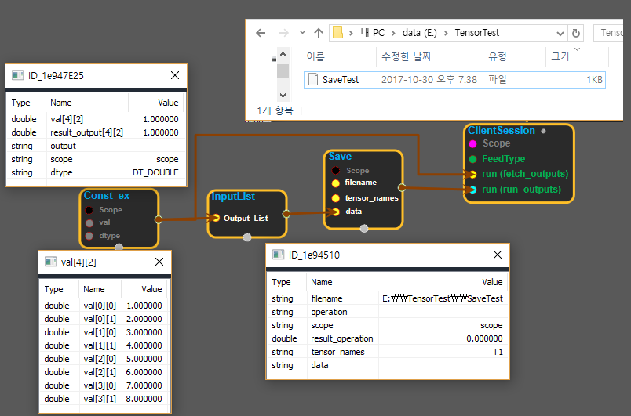

--- 
layout: default 
title: Save 
parent: io_ops 
grand_parent: enuSpace-Tensorflow API 
last_modified_date: now 
--- 

# Save

---

## tensorflow C++ API

[tensorflow::ops::Save](https://www.tensorflow.org/api_docs/cc/class/tensorflow/ops/save)

Saves the input tensors to disk.

---

## Summary

The size of `tensor_names `must match the number of tensors in`data`.`data[i]`is written to`filename`with name `tensor_names[i].`

See also`SaveSlices`.

Arguments:

* scope: A Scope object filename: Must have a single element. The name of the file to which we write the tensor.
* tensor\_names: Shape `[N] .` The names of the tensors to be saved.
* data: `N `tensors to save.

Returns:

* the created Operation.

Constructor

* Save\(const ::tensorflow::Scope & scope, ::tensorflow::Input filename, ::tensorflow::Input tensor\_names, ::tensorflow::InputList data\).

Public attributes

* tensorflow::Operation operation.

---

## Save block

Source link : [https://github.com/EXPNUNI/enuSpaceTensorflow/blob/master/enuSpaceTensorflow/tf\_i\_o\_\_ops.cpp](https://github.com/EXPNUNI/enuSpaceTensorflow/blob/master/enuSpaceTensorflow/tf_io_ops.cpp)

Argument:

* Scope scope : A Scope object \(A scope is generated automatically each page. A scope is not connected.\)
* Input filename : input filename with path.
* Input tensor\_names: input tensor\_names.
* InputList  data : connect InputList node.

Return:

* Operation operation: Operation operation of Save class object.  

Result:

* std::vector\(Tensor\) product\_result : Returned object of executed result by calling session.

---

## Using Method

