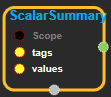
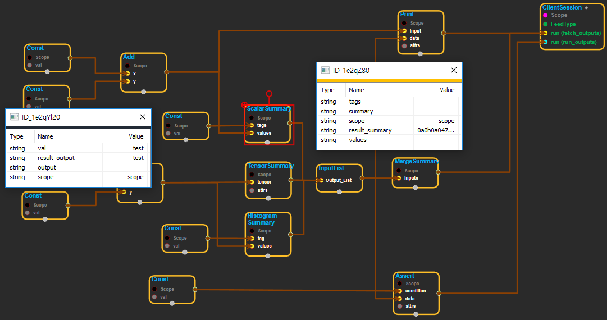

--- 
layout: default 
title: ScalarSummary 
parent: logging_ops 
grand_parent: enuSpace-Tensorflow API 
last_modified_date: now 
--- 

# ScalarSummary

---

## tensorflow C++ API

[tensorflow::ops::ScalarSummary](https://www.tensorflow.org/api_docs/cc/class/tensorflow/ops/scalar-summary)

Outputs a `Summary `protocol buffer with scalar values.

---

## Summary

The input`tags`and`values`must have the same shape. The generated summary has a summary value for each tag-value pair in`tags`and`values`.

Arguments:

* scope: A  [Scope](https://www.tensorflow.org/api_docs/cc/class/tensorflow/scope.html#classtensorflow_1_1_scope) object
* tags: Tags for the summary.
* values: Same shape as \`tags. Values for the summary.

Returns:

* [`Output`](https://www.tensorflow.org/api_docs/cc/class/tensorflow/output.html#classtensorflow_1_1_output) : Scalar. Serialized `Summary `protocol buffer.

---

## ScalarSummary block

Source link :[ https://github.com/EXPNUNI/enuSpace-Tensorflow/blob/master/enuSpaceTensorflow/tf\_logging\_ops.cpp](https://github.com/EXPNUNI/enuSpace-Tensorflow/blob/master/enuSpaceTensorflow/tf_logging_ops.cpp)

Argument:

* Scope scope : A Scope object \(A scope is generated automatically each page. A scope is not connected.\)
* Input tags : Input tag name node\(string\).
* Input values : Same shape as \`tags. Values for the summary.

Return:

* Output summary : Scalar. Serialized `Summary`protocol buffer.

Result:

* std::vector&lt;Tensor&gt; result\_summary : Returned object of executed result by calling session.

---

## Using Method

