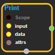
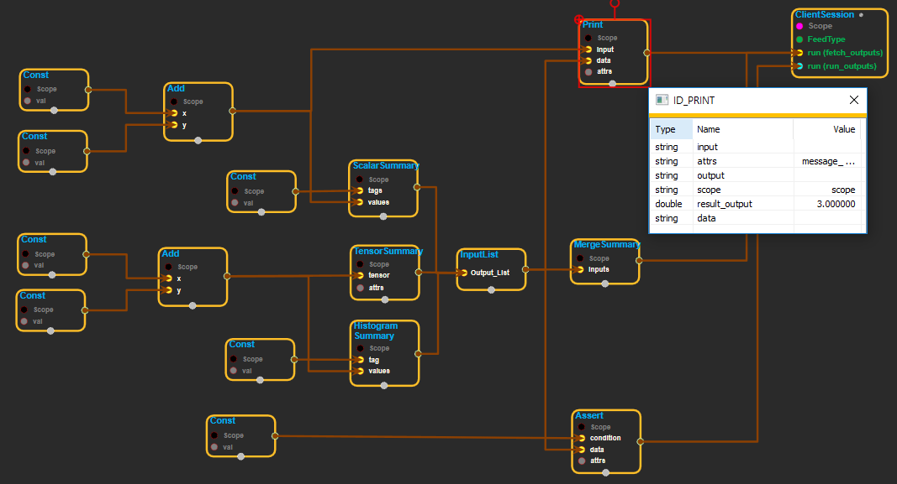

--- 
layout: default 
title: Print 
parent: logging_ops 
grand_parent: enuSpace-Tensorflow API 
last_modified_date: now 
--- 

# Print

---

## tensorflow C++ API

[tensorflow::ops::Print](https://www.tensorflow.org/api_docs/cc/class/tensorflow/ops/print)

Prints a list of tensors.

---

## Summary

Passes`input`through to`output`and prints`data`when evaluating.

Arguments:

* scope: A [Scope](https://www.tensorflow.org/api_docs/cc/class/tensorflow/scope.html#classtensorflow_1_1_scope) object 
* input: The tensor passed to `output `
* data: A list of tensors to print out when op is evaluated.

Optional attributes \(see[`Attrs`](https://www.tensorflow.org/api_docs/cc/struct/tensorflow/ops/print/attrs.html#structtensorflow_1_1ops_1_1_print_1_1_attrs)\):

* message: A string, prefix of the error message.
* first\_n: Only log `first_n `number of times. -1 disables logging.
* summarize: Only print this many entries of each tensor.

Returns:

* [`Output`](https://www.tensorflow.org/api_docs/cc/class/tensorflow/output.html#classtensorflow_1_1_output): = The unmodified `input `tensor

---

## Print block

Source link :[ https://github.com/EXPNUNI/enuSpace-Tensorflow/blob/master/enuSpaceTensorflow/tf\_logging\_ops.cpp](https://github.com/EXPNUNI/enuSpace-Tensorflow/blob/master/enuSpaceTensorflow/tf_logging_ops.cpp)

Argument:

* Scope scope : A Scope object \(A scope is generated automatically each page. A scope is not connected.\)
* Input inputs : The tensor passed to `output `
* InputList data : A list of tensors to print out when op is evaluated.

Return:

* Output output : The unmodified `input `tensor

Result:

* std::vector&lt;Tensor&gt; result\_output : Returned object of executed result by calling session.

---

## Using Method

