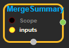
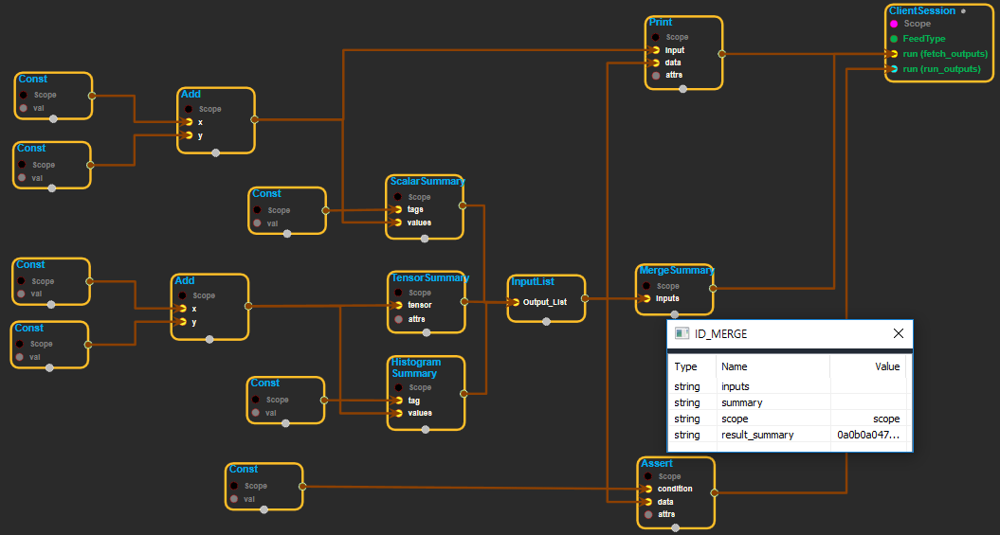

--- 
layout: default 
title: MergeSummary 
parent: logging_ops 
grand_parent: enuSpace-Tensorflow API 
last_modified_date: now 
--- 

# MergeSummary

---

## tensorflow C++ API

[tensorflow::ops::MergeSummary](https://www.tensorflow.org/api_docs/cc/class/tensorflow/ops/merge-summary)

Merges summaries.

---

## Summary

This op creates a[\`Summary\`](https://www.tensorflow.org/code/tensorflow/core/framework/summary.proto)protocol buffer that contains the union of all the values in the input summaries.

When the Op is run, it reports an`InvalidArgument`error if multiple values in the summaries to merge use the same tag.

Arguments:

* scope: A [Scope](https://www.tensorflow.org/api_docs/cc/class/tensorflow/scope.html#classtensorflow_1_1_scope) object
* inputs: Can be of any shape. Each must contain serialized `Summary `protocol buffers.

Returns:

* [`Output`](https://www.tensorflow.org/api_docs/cc/class/tensorflow/output.html#classtensorflow_1_1_output): Scalar. Serialized `Summary `protocol buffer.

---

## MergeSummary block

Source link :[ https://github.com/EXPNUNI/enuSpace-Tensorflow/blob/master/enuSpaceTensorflow/tf\_logging\_ops.cpp](https://github.com/EXPNUNI/enuSpace-Tensorflow/blob/master/enuSpaceTensorflow/tf_logging_ops.cpp)

Argument:

* Scope scope : A Scope object \(A scope is generated automatically each page. A scope is not connected.\)
* InputList inputs : InputList node.

Return:

* Output summary : Scalar. Serialized `Summary`protocol buffer.

Result:

* std::vector&lt;Tensor&gt; result\_summary : Returned object of executed result by calling session.

---

## Using Method

