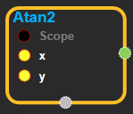
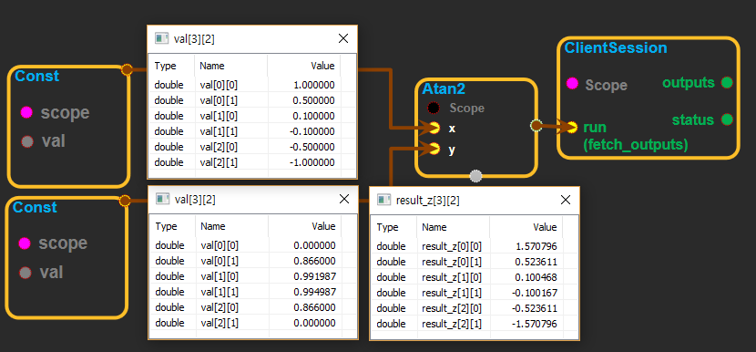

--- 
layout: default 
title: Atan2 
parent: math_ops 
grand_parent: enuSpace-Tensorflow API 
last_modified_date: now 
--- 

# Atan2

---

## tensorflow C++ API

[tensorflow::ops::Atan2](https://www.tensorflow.org/api_docs/cc/class/tensorflow/ops/atan2)

Computes arctangent of`y/x`element-wise, respecting signs of the arguments.

---

## Summary

This is the angle \( \[-, \] \) such that \[ x = r \(\) \] and \[ y = r \(\) \] where \(r = \(x^2 + y^2\) \).

Arguments:

* scope: A [Scope](https://www.tensorflow.org/api_docs/cc/class/tensorflow/scope.html#classtensorflow_1_1_scope) object

Returns:

* [`Output`](https://www.tensorflow.org/api_docs/cc/class/tensorflow/output.html#classtensorflow_1_1_output): The z tensor.

Constructor

* Atan2\(const ::tensorflow::Scope & scope, ::tensorflow::Input y, ::tensorflow::Input x\).

Public attributes

* tensorflow::Output z.

---

## Atan2 block

Source link : [https://github.com/EXPNUNI/enuSpaceTensorflow/blob/master/enuSpaceTensorflow/tf\_math.cpp](https://github.com/EXPNUNI/enuSpaceTensorflow/blob/master/enuSpaceTensorflow/tf_math.cpp)

Argument:

* Scope scope : A Scope object \(A scope is generated automatically each page. A scope is not connected.\)
* Input y :connect  Input node.
* Input x :connect  Input node.

Return:

* Output z : Output object of Atan2 class object.

Result:

* std::vector\(Tensor\) product\_result : Returned object of executed result by calling session.

---

## Using Method

