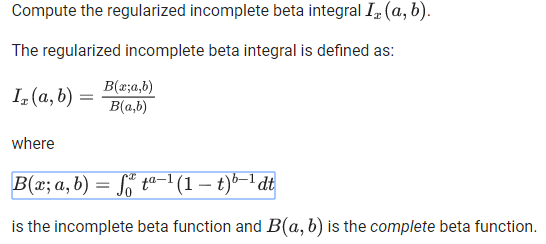
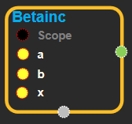
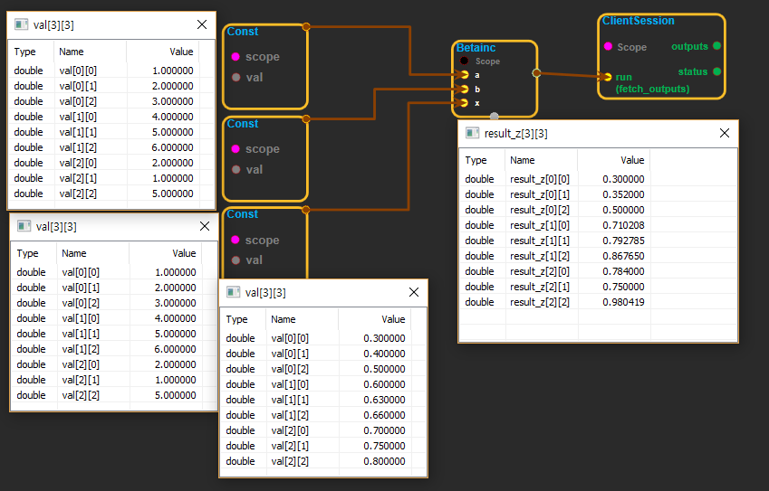

--- 
layout: default 
title: Betainc 
parent: math_ops 
grand_parent: enuSpace-Tensorflow API 
last_modified_date: now 
--- 

# Betainc

---

## tensorflow C++ API

[tensorflow::ops::Betainc](https://www.tensorflow.org/api_docs/cc/class/tensorflow/ops/betainc)

Compute the regularized incomplete beta integral \(I\_x\(a, b\)\).

---

## Summary

Arguments:

* scope: A [Scope](https://www.tensorflow.org/api_docs/cc/class/tensorflow/scope.html#classtensorflow_1_1_scope) object

* a: must be nonnegative and real. All arrays must be the same size.

* b:must be nonnegative and real. All arrays must be the same size.

* x: must be in the closed interval \[0,1\].

Returns:

* [`Output`](https://www.tensorflow.org/api_docs/cc/class/tensorflow/output.html#classtensorflow_1_1_output): The z tensor.

Constructor

* Betainc\(const ::tensorflow::Scope & scope, ::tensorflow::Input x, ::tensorflow::Input a, ::tensorflow::Input b\).

Public attributes

* tensorflow::Output z.

---

## Betainc block

Source link : [https://github.com/EXPNUNI/enuSpaceTensorflow/blob/master/enuSpaceTensorflow/tf\_math.cpp](https://github.com/EXPNUNI/enuSpaceTensorflow/blob/master/enuSpaceTensorflow/tf_math.cpp)

Argument:

* Scope scope : A Scope object \(A scope is generated automatically each page. A scope is not connected.\).
* Input a :connect  Input node.
* Input b :connect  Input node.
* Input x :connect  Input node.

Return:

* Output z : Output object of Betainc class object.

Result:

* std::vector\(Tensor\) product\_result : Returned object of executed result by calling session.

---

## Using Method

