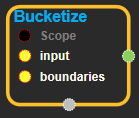
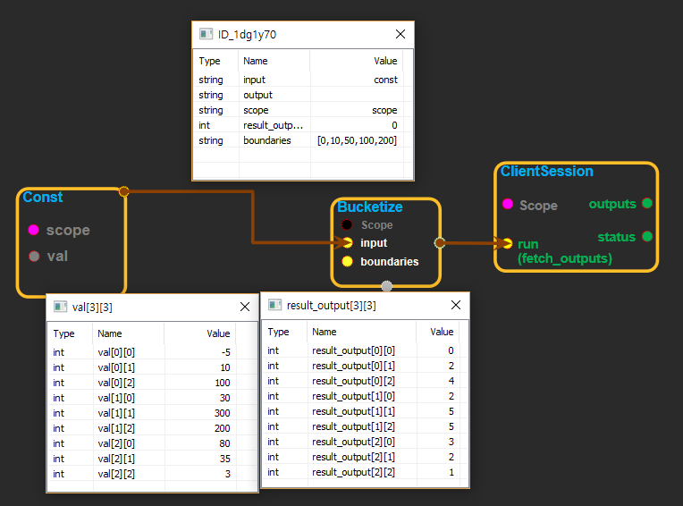

--- 
layout: default 
title: Bucketize 
parent: math_ops 
grand_parent: enuSpace-Tensorflow API 
last_modified_date: now 
--- 

# Bucketize

---

## tensorflow C++ API

[tensorflow::ops::Bucketize](https://www.tensorflow.org/api_docs/cc/class/tensorflow/ops/bucketize)

Bucketizes 'input' based on 'boundaries'.

---

## Summary

For example, if the inputs are boundaries = \[0, 10, 100\] input = \[\[-5, 10000\] \[150, 10\] \[5, 100\]\]

then the output will be output = \[\[0, 3\] \[3, 2\] \[1, 3\]\]

Arguments:

* scope: A [Scope](https://www.tensorflow.org/api_docs/cc/class/tensorflow/scope.html#classtensorflow_1_1_scope) object
* input:[Any](https://www.tensorflow.org/api_docs/cc/class/tensorflow/ops/any.html#classtensorflow_1_1ops_1_1_any) shape of [Tensor](https://www.tensorflow.org/api_docs/cc/class/tensorflow/tensor.html#classtensorflow_1_1_tensor) contains with int or float type.
* boundaries: A sorted list of floats gives the boundary of the buckets.

Returns:

* [`Output`](https://www.tensorflow.org/api_docs/cc/class/tensorflow/output.html#classtensorflow_1_1_output): Same shape with 'input', each value of input replaced with bucket index.

Constructor

* Bucketize\(const ::tensorflow::Scope & scope, ::tensorflow::Input input, ::tensorflow::Input boundaries\).

Public attributes

* tensorflow::Output output.

---

## Bucketize block

Source link : [https://github.com/EXPNUNI/enuSpaceTensorflow/blob/master/enuSpaceTensorflow/tf\_math.cpp](https://github.com/EXPNUNI/enuSpaceTensorflow/blob/master/enuSpaceTensorflow/tf_math.cpp)

Argument:

* Scope scope : A Scope object \(A scope is generated automatically each page. A scope is not connected.\).
* Input input:connect  Input node.
* Input boundaries:connect  Input node.

Return:

* Output output : Output object of Bucketize class object.

Result:

* std::vector\(Tensor\) product\_result : Returned object of executed result by calling session.

---

## Using Method

