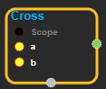
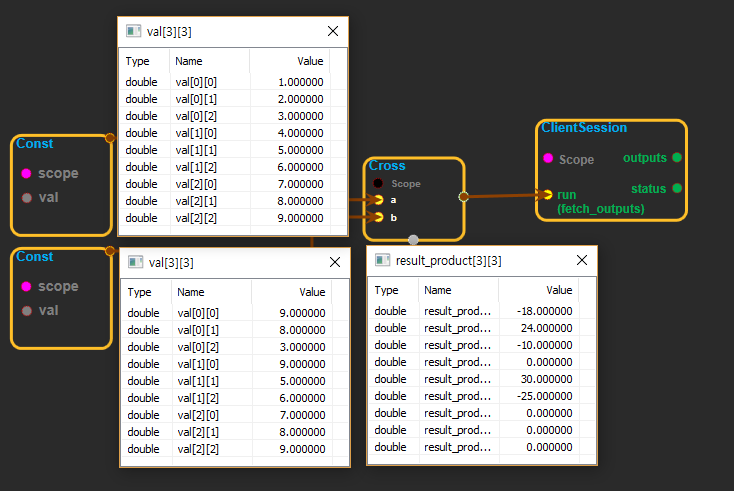

--- 
layout: default 
title: Cross 
parent: math_ops 
grand_parent: enuSpace-Tensorflow API 
last_modified_date: now 
--- 

# Cross

---

## tensorflow C++ API

[tensorflow::ops::Cross](https://www.tensorflow.org/api_docs/cc/class/tensorflow/ops/cross)

Compute the pairwise cross product.

---

## Summary

`a`and`b`must be the same shape; they can either be simple 3-element vectors, or any shape where the innermost dimension is 3. In the latter case, each pair of corresponding 3-element vectors is cross-multiplied independently.

Arguments:

* scope: A [Scope](https://www.tensorflow.org/api_docs/cc/class/tensorflow/scope.html#classtensorflow_1_1_scope) object
* a: A tensor containing 3-element vectors.
* b: Another tensor, of same type and shape as`a.`

Returns:

* [`Output`](https://www.tensorflow.org/api_docs/cc/class/tensorflow/output.html#classtensorflow_1_1_output): The product tensor.

Constructor

* Cross\(const ::tensorflow::Scope & scope, ::tensorflow::Input a, ::tensorflow::Input b\).

Public attributes

* tensorflow::Output product.

---

## Cross block

Source link : [https://github.com/EXPNUNI/enuSpaceTensorflow/blob/master/enuSpaceTensorflow/tf\_math.cpp](https://github.com/EXPNUNI/enuSpaceTensorflow/blob/master/enuSpaceTensorflow/tf_math.cpp)

Argument:

* Scope scope : A Scope object \(A scope is generated automatically each page. A scope is not connected.\).
* Input a:connect  Input node.
* Input b:connect  Input node.

Return:

* Output product: Output object of Cross class object.

Result:

* std::vector\(Tensor\) product\_result : Returned object of executed result by calling session.

---

## Using Method

