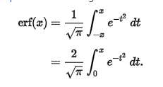
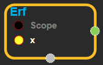
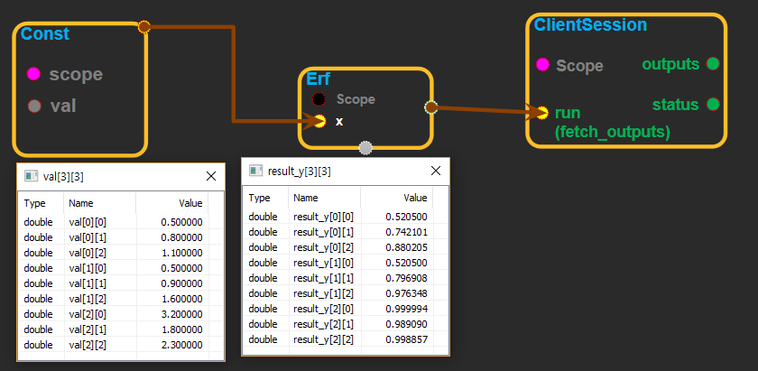

--- 
layout: default 
title: Erf 
parent: math_ops 
grand_parent: enuSpace-Tensorflow API 
last_modified_date: now 
--- 

# Erf

---

## tensorflow C++ API

[tensorflow::ops::Erf](https://www.tensorflow.org/api_docs/cc/class/tensorflow/ops/erf)

Computes the Gauss error function of`x`element-wise.

---

## Summary

In [mathematics](https://en.wikipedia.org/wiki/Mathematics), the **error function**\(also called the **Gauss error function **\) is a [special function](https://en.wikipedia.org/wiki/Special_function)\(non-[elementary](https://en.wikipedia.org/wiki/Elementary_function)\) of [sigmoid](https://en.wikipedia.org/wiki/Sigmoid_function) shape that occurs in [probability](https://en.wikipedia.org/wiki/Probability),[statistics](https://en.wikipedia.org/wiki/Statistics), and [partial differential equations](https://en.wikipedia.org/wiki/Partial_differential_equation) describing diffusion. It is defined as:

Arguments:

* scope: A [Scope](https://www.tensorflow.org/api_docs/cc/class/tensorflow/scope.html#classtensorflow_1_1_scope) object

Returns:

* [`Output`](https://www.tensorflow.org/api_docs/cc/class/tensorflow/output.html#classtensorflow_1_1_output): The y tensor.

Constructor

* Erf\(const ::tensorflow::Scope & scope, ::tensorflow::Input x\).

Public attributes

* tensorflow::Output y.

---

## Erf block

Source link : [https://github.com/EXPNUNI/enuSpaceTensorflow/blob/master/enuSpaceTensorflow/tf\_math.cpp](https://github.com/EXPNUNI/enuSpaceTensorflow/blob/master/enuSpaceTensorflow/tf_math.cpp)

Argument:

* Scope scope : A Scope object \(A scope is generated automatically each page. A scope is not connected.\).
* Input x:connect  Input node.

Return:

* Output y: Output object of Erf class object.

Result:

* std::vector\(Tensor\) product\_result : Returned object of executed result by calling session.

---

## Using Method

