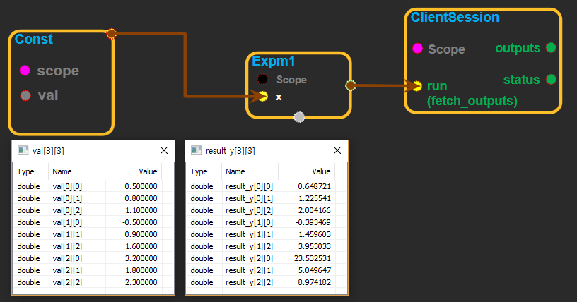

--- 
layout: default 
title: Expm1 
parent: math_ops 
grand_parent: enuSpace-Tensorflow API 
last_modified_date: now 
--- 

# Expm1

---

## tensorflow C++ API

[tensorflow::ops::Expm1](https://www.tensorflow.org/api_docs/cc/class/tensorflow/ops/expm1)

Computes exponential of x - 1 element-wise.

---

## Summary

I.e., y = \(x\) - 1.

Arguments:

* scope: A [Scope](https://www.tensorflow.org/api_docs/cc/class/tensorflow/scope.html#classtensorflow_1_1_scope) object

Returns:

* [`Output`](https://www.tensorflow.org/api_docs/cc/class/tensorflow/output.html#classtensorflow_1_1_output): The y tensor.

Constructor

* Expm1\(const ::tensorflow::Scope & scope, ::tensorflow::Input x\).

Public attributes

* tensorflow::Output y.

---

## Expm1 block

Source link : [https://github.com/EXPNUNI/enuSpaceTensorflow/blob/master/enuSpaceTensorflow/tf\_math.cpp](https://github.com/EXPNUNI/enuSpaceTensorflow/blob/master/enuSpaceTensorflow/tf_math.cpp)

Argument:

* Scope scope : A Scope object \(A scope is generated automatically each page. A scope is not connected.\).
* Input x:connect  Input node.

Return:

* Output y: Output object of Expm1 class object.

Result:

* std::vector\(Tensor\) product\_result : Returned object of executed result by calling session.

---

## Using Method

