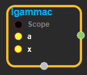
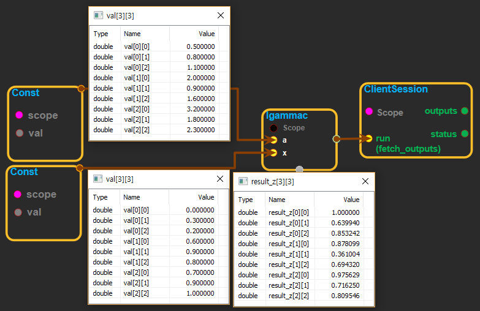

--- 
layout: default 
title: Igammac 
parent: math_ops 
grand_parent: enuSpace-Tensorflow API 
last_modified_date: now 
--- 

# Igammac

---

## tensorflow C++ API

[tensorflow::ops::Igammac](https://www.tensorflow.org/api_docs/cc/class/tensorflow/ops/igammac)

Compute the upper regularized incomplete Gamma function`Q(a, x)`.

---

## Summary

The upper regularized incomplete Gamma function is defined as:

Q\(a, x\) = Gamma\(a, x\) / Gamma\(a\) = 1 - P\(a, x\)

where

Gamma\(a, x\) = int\_{x}^{} t^{a-1} exp\(-t\) dt

is the upper incomplete Gama function.

Note, above`P(a, x)`\([`Igamma`](https://www.tensorflow.org/api_docs/cc/class/tensorflow/ops/igamma.html#classtensorflow_1_1ops_1_1_igamma)\) is the lower regularized complete Gamma function.

Arguments:

* scope: A [Scope](https://www.tensorflow.org/api_docs/cc/class/tensorflow/scope.html#classtensorflow_1_1_scope) object

Returns:

* [`Output`](https://www.tensorflow.org/api_docs/cc/class/tensorflow/output.html#classtensorflow_1_1_output): The z tensor.

Constructor

* Igammac\(const ::tensorflow::Scope & scope, ::tensorflow::Input a, ::tensorflow::Input x\).

Public attributes

* tensorflow::Output z.

---

## Igammac block

Source link : [https://github.com/EXPNUNI/enuSpaceTensorflow/blob/master/enuSpaceTensorflow/tf\_math.cpp](https://github.com/EXPNUNI/enuSpaceTensorflow/blob/master/enuSpaceTensorflow/tf_math.cpp)

Argument:

* Scope scope : A Scope object \(A scope is generated automatically each page. A scope is not connected.\).
* Input a:connect  Input node.
* Input x:connect  Input node.

Return:

* Output z: Output object of Igammac class object.

Result:

* std::vector\(Tensor\) product\_result : Returned object of executed result by calling session.

---

## Using Method

