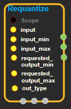

--- 
layout: default 
title: Requantize 
parent: math_ops 
grand_parent: enuSpace-Tensorflow API 
last_modified_date: now 
--- 

# Requantize

---

## tensorflow C++ API

[tensorflow::ops::Requantize](https://www.tensorflow.org/api_docs/cc/class/tensorflow/ops/requantize)

Convert the quantized 'input' tensor into a lower-precision 'output', using the output range specified with 'requested\_output\_min' and 'requested\_output\_max'.

---

## Summary

\[input\_min, input\_max\] are scalar floats that specify the range for the float interpretation of the 'input' data. For example, if input\_min is -1.0f and input\_max is 1.0f, and we are dealing with quint16 quantized data, then a 0 value in the 16-bit data should be interpreted as -1.0f, and a 65535 means 1.0f.

Arguments:

* scope: A [Scope](https://www.tensorflow.org/api_docs/cc/class/tensorflow/scope.html#classtensorflow_1_1_scope) object
* input\_min: The float value that the minimum quantized input value represents.
* input\_max: The float value that the maximum quantized input value represents.
* requested\_output\_min: The float value that the minimum quantized output value represents.
* requested\_output\_max: The float value that the maximum quantized output value represents.
* out\_type: The type of the output. Should be a lower bit depth than Tinput.

Output

* Output  output
* Output  output\_min: The computed min output.
* Output  output\_max: The computed max output.

Constructor

* QuantizeDownAndShrinkRange\(const ::tensorflow::Scope & scope, ::tensorflow::Input input, ::tensorflow::Input input\_min, ::tensorflow::Input input\_max, DataType out\_type\) 

Public attributes

* tensorflow::Output output.
* tensorflow::Output output\_min.
* tensorflow::Output output\_max.

---

## Requantize block

Source link : [https://github.com/EXPNUNI/enuSpaceTensorflow/blob/master/enuSpaceTensorflow/tf\_math.cpp](https://github.com/EXPNUNI/enuSpaceTensorflow/blob/master/enuSpaceTensorflow/tf_math.cpp)

Argument:

* Scope scope : A Scope object \(A scope is generated automatically each page. A scope is not connected.\).
* Input input : connect  Input node.
* Input input\_min : connect  Input node.
* Input input\_max : connect  Input node.
* Input requested\_output\_min : connect  Input node.
* Input requested\_output\_max : connect  Input node.
* DataType out\_type : input DataType. ex\)DT\_\_QINT8  

Return:

* Output output: Output object of Requantize class object.

Result:

* std::vector\(Tensor\) product\_result : Returned object of executed result by calling session.

---

## Using Method

tensorflow -&gt; error: No OpKernel was registered to support Op 'Requantize' with these attrs.  Registered devices: \[CPU,GPU\], Registered kernels:

&lt;no registered kernels&gt;

\[\[Node: Requantize = Requantize\[Tinput=DT\_QINT16,out\_type=DT\_QINT8\]\(Cast, Const\_2, Const\_4, Const\_2, Const\_4\)\]\].

