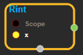
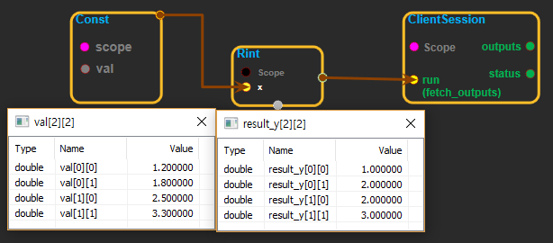

--- 
layout: default 
title: Rint 
parent: math_ops 
grand_parent: enuSpace-Tensorflow API 
last_modified_date: now 
--- 

# Rint

---

## tensorflow C++ API

[tensorflow::ops::Rint](https://www.tensorflow.org/api_docs/cc/class/tensorflow/ops/rint)

Returns element-wise integer closest to x.

---

## Summary

If the result is midway between two representable values, the even representable is chosen. For example:

\`\`\` rint\(-1.5\) ==&gt; -2.0 rint\(0.5000001\) ==&gt; 1.0 rint\(\[-1.7, -1.5, -0.2, 0.2, 1.5, 1.7, 2.0\]\) ==&gt; \[-2., -2., -0., 0., 2., 2., 2.\] \`\`\`

Arguments:

* scope: A [Scope](https://www.tensorflow.org/api_docs/cc/class/tensorflow/scope.html#classtensorflow_1_1_scope) object

Returns:

* [`Output`](https://www.tensorflow.org/api_docs/cc/class/tensorflow/output.html#classtensorflow_1_1_output): The y tensor.

Constructor

* Rint\(const ::tensorflow::Scope & scope,  ::tensorflow::Input x\).

Public attributes

* tensorflow::Output y.

---

## Rint block

Source link : [https://github.com/EXPNUNI/enuSpaceTensorflow/blob/master/enuSpaceTensorflow/tf\_math.cpp](https://github.com/EXPNUNI/enuSpaceTensorflow/blob/master/enuSpaceTensorflow/tf_math.cpp)

Argument:

* Scope scope : A Scope object \(A scope is generated automatically each page. A scope is not connected.\).
* Input x:connect  Input node.

Return:

* Output y: Output object of Rint class object.

Result:

* std::vector\(Tensor\) product\_result : Returned object of executed result by calling session.

---

## Using Method

