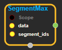
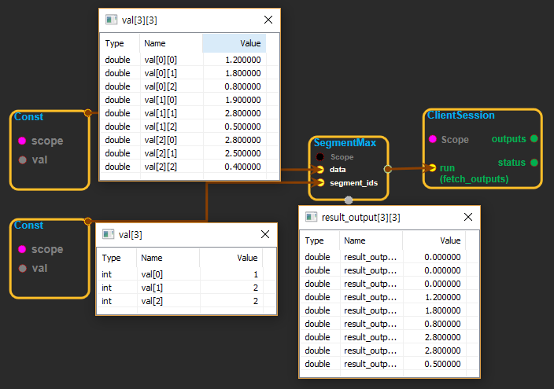

--- 
layout: default 
title: SegmentMax 
parent: math_ops 
grand_parent: enuSpace-Tensorflow API 
last_modified_date: now 
--- 

# SegmentMax

---

## tensorflow C++ API

[tensorflow::ops::SegmentMax](https://www.tensorflow.org/api_docs/cc/class/tensorflow/ops/segment-max)

Computes the maximum along segments of a tensor.

---

## Summary

Read the section on segmentation for an explanation of segments.

Computes a tensor such that output\_i = \(data\_j\) where`max`is over`j`such that`segment_ids[j] == i`.

If the max is empty for a given segment ID`i`,`output[i] = 0`.

Arguments:

* scope: A [Scope](https://www.tensorflow.org/api_docs/cc/class/tensorflow/scope.html#classtensorflow_1_1_scope) object
* segment\_ids: A 1-D tensor whose rank is equal to the rank of data's first dimension. Values should be sorted and can be repeated.

Returns:

* [`Output`](https://www.tensorflow.org/api_docs/cc/class/tensorflow/output.html#classtensorflow_1_1_output): Has same shape as data, except for dimension 0 which has size`k`, the number of segments.

Constructor

* SegmentMax\(const ::tensorflow::Scope & scope, ::tensorflow::Input data, ::tensorflow::Input segment\_ids\) 

Public attributes

* tensorflow::Output output.

---

## SegmentMax block

Source link : [https://github.com/EXPNUNI/enuSpaceTensorflow/blob/master/enuSpaceTensorflow/tf\_math.cpp](https://github.com/EXPNUNI/enuSpaceTensorflow/blob/master/enuSpaceTensorflow/tf_math.cpp)

Argument:

* Scope scope : A Scope object \(A scope is generated automatically each page. A scope is not connected.\).
* Input data:connect  Input node.
* Input segment\_ids:connect  Input node.

Return:

* Output output: Output object of SegmentMax class object.

Result:

* std::vector\(Tensor\) product\_result : Returned object of executed result by calling session.

---

## Using Method

