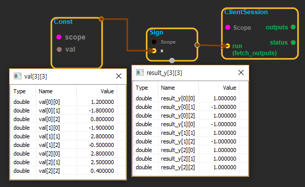

--- 
layout: default 
title: Sign 
parent: math_ops 
grand_parent: enuSpace-Tensorflow API 
last_modified_date: now 
--- 

# Sign

---

## tensorflow C++ API

[tensorflow::ops::Sign](https://www.tensorflow.org/api_docs/cc/class/tensorflow/ops/sign)

Returns an element-wise indication of the sign of a number.

---

## Summary

`y = sign(x) = -1`if`x < 0`; 0 if`x == 0`; 1 if`x > 0`.

For complex numbers,`y = sign(x) = x / |x|`if`x != 0`, otherwise`y = 0`.

Arguments:

* scope: A [Scope](https://www.tensorflow.org/api_docs/cc/class/tensorflow/scope.html#classtensorflow_1_1_scope) object

Returns:

* [`Output`](https://www.tensorflow.org/api_docs/cc/class/tensorflow/output.html#classtensorflow_1_1_output): The y tensor.

Constructor

* Sign\(const ::tensorflow::Scope & scope, ::tensorflow::Input x\) 

Public attributes

* tensorflow::Output y.

---

## Sign block

Source link : [https://github.com/EXPNUNI/enuSpaceTensorflow/blob/master/enuSpaceTensorflow/tf\_math.cpp](https://github.com/EXPNUNI/enuSpaceTensorflow/blob/master/enuSpaceTensorflow/tf_math.cpp)

Argument:

* Scope scope : A Scope object \(A scope is generated automatically each page. A scope is not connected.\).
* Input x : connect  Input node.

Return:

* Output output: Output object of Sign class object.

Result:

* std::vector\(Tensor\) product\_result : Returned object of executed result by calling session.

---

## Using Method

