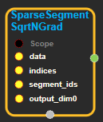
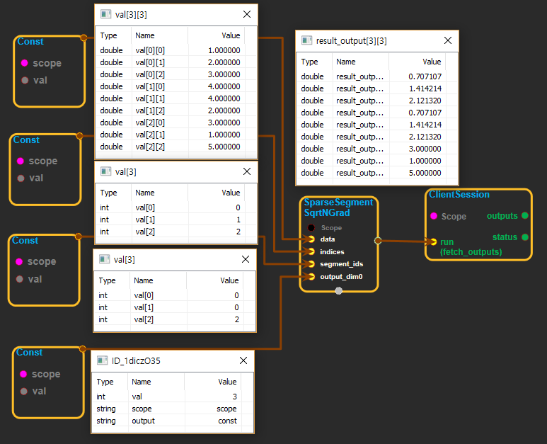

--- 
layout: default 
title: SparseSegmentSqrtNGrad 
parent: math_ops 
grand_parent: enuSpace-Tensorflow API 
last_modified_date: now 
--- 

# SparseSegmentSqrtNGrad

---

## tensorflow C++ API

[tensorflow::ops::SparseSegmentSqrtNGrad](https://www.tensorflow.org/api_docs/cc/class/tensorflow/ops/sparse-segment-sqrt-n-grad)

Computes gradients for [SparseSegmentSqrtN](https://www.tensorflow.org/api_docs/cc/class/tensorflow/ops/sparse-segment-sqrt-n.html#classtensorflow_1_1ops_1_1_sparse_segment_sqrt_n).

---

## Summary

Returns tensor "output" with same shape as grad, except for dimension 0 whose value is output\_dim0.

Arguments:

* scope: A[Scope](https://www.tensorflow.org/api_docs/cc/class/tensorflow/scope.html#classtensorflow_1_1_scope) object
* grad: gradient propagated to the [SparseSegmentSqrtN](https://www.tensorflow.org/api_docs/cc/class/tensorflow/ops/sparse-segment-sqrt-n.html#classtensorflow_1_1ops_1_1_sparse_segment_sqrt_n) op.
* indices: indices passed to the corresponding [SparseSegmentSqrtN](https://www.tensorflow.org/api_docs/cc/class/tensorflow/ops/sparse-segment-sqrt-n.html#classtensorflow_1_1ops_1_1_sparse_segment_sqrt_n) op.
* segment\_ids: segment\_ids passed to the corresponding [SparseSegmentSqrtN](https://www.tensorflow.org/api_docs/cc/class/tensorflow/ops/sparse-segment-sqrt-n.html#classtensorflow_1_1ops_1_1_sparse_segment_sqrt_n) op.
* output\_dim0: dimension 0 of "data" passed to [SparseSegmentSqrtN](https://www.tensorflow.org/api_docs/cc/class/tensorflow/ops/sparse-segment-sqrt-n.html#classtensorflow_1_1ops_1_1_sparse_segment_sqrt_n) op.

Returns:

* [`Output`](https://www.tensorflow.org/api_docs/cc/class/tensorflow/output.html#classtensorflow_1_1_output): The output tensor.

Constructor

* SparseSegmentSqrtNGrad\(const ::tensorflow::Scope & scope, ::tensorflow::Input grad, ::tensorflow::Input indices, ::tensorflow::Input segment\_ids, ::tensorflow::Input output\_dim0\) 

Public attributes

* tensorflow::Output output 

---

## SparseSegmentSqrtNGrad block

Source link : [https://github.com/EXPNUNI/enuSpaceTensorflow/blob/master/enuSpaceTensorflow/tf\_math.cpp](https://github.com/EXPNUNI/enuSpaceTensorflow/blob/master/enuSpaceTensorflow/tf_math.cpp)

Argument:

* Scope scope : A Scope object\(A scope is generated automatically each page. A scope is not connected.\).
* Input data : connect  Input node.
* Input indices : connect  Input node.
* Input segment\_ids : connect Input node.
* Input output\_dim0 : connect Input node.

Return:

* Output product : Output object of SparseSegmentSqrtNGrad class object. 

Result:

* std::vector\(Tensor\) product\_result : Returned object of executed result by calling session.

---

## Using Method

