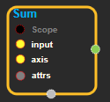
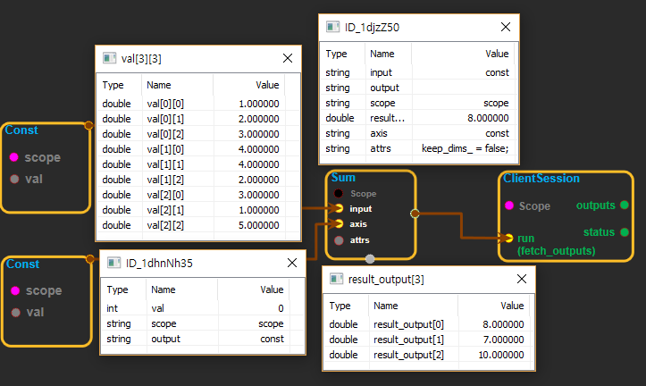

--- 
layout: default 
title: Sum 
parent: math_ops 
grand_parent: enuSpace-Tensorflow API 
last_modified_date: now 
--- 

# Sum

---

## tensorflow C++ API

[tensorflow::ops::Sum](https://www.tensorflow.org/api_docs/cc/class/tensorflow/ops/sum)

Computes the sum of elements across dimensions of a tensor.

---

## Summary

Reduces`input`along the dimensions given in`axis`. Unless`keep_dims`is true, the rank of the tensor is reduced by 1 for each entry in`axis`. If`keep_dims`is true, the reduced dimensions are retained with length 1.

Arguments:

* scope: A [Scope](https://www.tensorflow.org/api_docs/cc/class/tensorflow/scope.html#classtensorflow_1_1_scope) object
* input: The tensor to reduce.
* axis: The dimensions to reduce.Row :axis 1,Col axis : 0

Returns:

* [`Output`](https://www.tensorflow.org/api_docs/cc/class/tensorflow/output.html#classtensorflow_1_1_output): The reduced tensor.

Constructor

* Sum\(const ::tensorflow::Scope & scope, ::tensorflow::Input input, ::tensorflow::Input axis, const Sum::Attrs & attrs\).

Public attributes

* tensorflow::Output output.

---

## Sum block

Source link : [https://github.com/EXPNUNI/enuSpaceTensorflow/blob/master/enuSpaceTensorflow/tf\_math.cpp](https://github.com/EXPNUNI/enuSpaceTensorflow/blob/master/enuSpaceTensorflow/tf_math.cpp)

Argument:

* Scope scope : A Scope object \(A scope is generated automatically each page. A scope is not connected.\).
* Input input:connect  Input node.
* Input axis:connect  Input node.
* Sum::Attrs attrs : Input attrs value. ex\) keep\_dims\_ = false;

Return:

* Output output: Output object of Sum class object.

Result:

* std::vector\(Tensor\) product\_result : Returned object of executed result by calling session.

---

## Using Method

