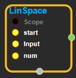

--- 
layout: default 
title: LinSpace 
parent: math_ops 
grand_parent: enuSpace-Tensorflow API 
last_modified_date: now 
--- 

# LinSpace

---

## tensorflow C++ API

[tensorflow::ops::LinSpace](https://www.tensorflow.org/api_docs/cc/class/tensorflow/ops/lin-space)

Generates values in an interval.

---

## Summary

A sequence of`num`evenly-spaced values are generated beginning at`start`. If`num > 1`, the values in the sequence increase by`stop - start / num - 1`, so that the last one is exactly`stop`.

For example:

\`\`\` tf.linspace\(10.0, 12.0, 3, name="linspace"\) =&gt; \[ 10.0 11.0 12.0\] \`\`\`

Arguments:

* scope: A [Scope](https://www.tensorflow.org/api_docs/cc/class/tensorflow/scope.html#classtensorflow_1_1_scope) object
* start: First entry in the range.
* stop: Last entry in the range.
* num: Number of values to generate.

Returns:

* `Output`: 1-D. The generated value

Constructor

* LinSpace\(const ::tensorflow::Scope & scope,  ::tensorflow::Input start,  ::tensorflow::Input stop,  ::tensorflow::Input num\).

Public attributes

* tensorflow::Output output.

---

## LinSpace block

Source link : [https://github.com/EXPNUNI/enuSpaceTensorflow/blob/master/enuSpaceTensorflow/tf\_math.cpp](https://github.com/EXPNUNI/enuSpaceTensorflow/blob/master/enuSpaceTensorflow/tf_math.cpp)

Argument:

* Scope scope : A Scope object \(A scope is generated automatically each page. A scope is not connected.\).
* Input start:connect  Input node.
* Input stop:connect  Input node.
* Input num:connect  Input node.

Return:

* Output output: Output object of LinSpace class object.

Result:

* std::vector\(Tensor\) product\_result : Returned object of executed result by calling session.

---

## Using Method

