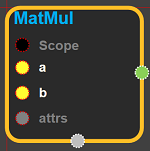
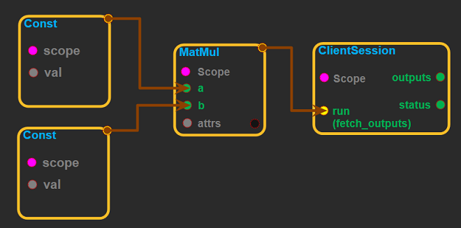

--- 
layout: default 
title: MatMul 
parent: math_ops 
grand_parent: enuSpace-Tensorflow API 
last_modified_date: now 
--- 

# MatMul

---

## tensorflow C++ API

[tensorflow::ops::MatMul](https://www.tensorflow.org/api_docs/cc/class/tensorflow/ops/mat-mul)

[Multiply](https://www.tensorflow.org/api_docs/cc/class/tensorflow/ops/multiply.html#classtensorflow_1_1ops_1_1_multiply) the matrix "a" by the matrix "b".

---

## Summary

The inputs must be two-dimensional matrices and the inner dimension of "a" \(after being transposed if transpose\_a is true\) must match the outer dimension of "b" \(after being transposed if transposed\_b is true\).

Note: The default kernel implementation for[MatMul](https://www.tensorflow.org/api_docs/cc/class/tensorflow/ops/mat-mul.html#classtensorflow_1_1ops_1_1_mat_mul)on GPUs uses cublas.

Arguments:

* scope: A [Scope](https://www.tensorflow.org/api_docs/cc/class/tensorflow/scope.html#classtensorflow_1_1_scope) object

Optional attributes \(see[`Attrs`](https://www.tensorflow.org/api_docs/cc/struct/tensorflow/ops/mat-mul/attrs.html#structtensorflow_1_1ops_1_1_mat_mul_1_1_attrs)\):

* transpose\_a: If true, "a" is transposed before multiplication.
* transpose\_b: If true, "b" is transposed before multiplication.

Returns:

* [`Output`](https://www.tensorflow.org/api_docs/cc/class/tensorflow/output.html#classtensorflow_1_1_output): The product tensor.

Constructor

* MatMul\(const ::tensorflow::Scope & scope, ::tensorflow::Input a, ::tensorflow::Input b, const MatMul::Attrs & attrs\) 

Public attributes

* tensorflow::Output product

---

## MatMul block

Source link : [https://github.com/EXPNUNI/enuSpaceTensorflow/blob/master/enuSpaceTensorflow/tf\_math.cpp](https://github.com/EXPNUNI/enuSpaceTensorflow/blob/master/enuSpaceTensorflow/tf_math.cpp)

Argument:

* Scope scope : A Scope object\(A scope is generated automatically each page. A scope is not connected.\).
* Input a : connect  Input node.
* Input b : connect  Input node.
* MatMul::Attrs attrs : Input attrs in value. ex\) transpose\_a\_=true;transpose\_b\_=false

Return:

* Output product : Output object of MatMul class object. 

Result:

* std::vector\(Tensor\) product\_result : Returned object of executed result by calling session.

---

## Using Method

