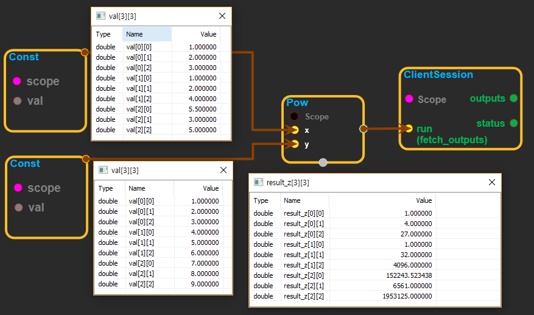

--- 
layout: default 
title: Pow 
parent: math_ops 
grand_parent: enuSpace-Tensorflow API 
last_modified_date: now 
--- 

# Pow

---

## tensorflow C++ API

[tensorflow::ops::Pow](https://www.tensorflow.org/api_docs/cc/class/tensorflow/ops/pow)

Computes the power of one value to another.

---

## Summary

Given a tensor`x`and a tensor`y`, this operation computes x^y for corresponding elements in`x`and`y`. For example:

\`\`\` tensor 'x' is \[\[2, 2\]\], \[3, 3\]\]

tensor 'y' is \[\[8, 16\], \[2, 3\]\]

tf.pow\(x, y\) ==&gt; \[\[256, 65536\], \[9, 27\]\] \`\`\`

Arguments:

* scope: A [Scope](https://www.tensorflow.org/api_docs/cc/class/tensorflow/scope.html#classtensorflow_1_1_scope) object

Returns:

* [`Output`](https://www.tensorflow.org/api_docs/cc/class/tensorflow/output.html#classtensorflow_1_1_output): The z tensor.

Constructor

* Pow\(const ::tensorflow::Scope & scope,  ::tensorflow::Input x,  ::tensorflow::Input y\).

Public attributes

* tensorflow::Output z.

---

## Pow block

Source link : [https://github.com/EXPNUNI/enuSpaceTensorflow/blob/master/enuSpaceTensorflow/tf\_math.cpp](https://github.com/EXPNUNI/enuSpaceTensorflow/blob/master/enuSpaceTensorflow/tf_math.cpp)

Argument:

* Scope scope : A Scope object \(A scope is generated automatically each page. A scope is not connected.\).
* Input x:connect  Input node.
* Input y:connect  Input node.

Return:

* Output z: Output object of Pow class object.

Result:

* std::vector\(Tensor\) product\_result : Returned object of executed result by calling session.

---

## Using Method

