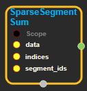
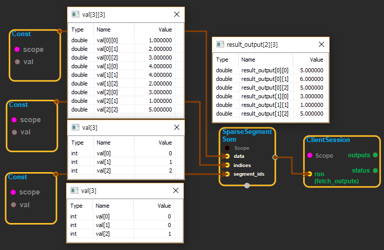

--- 
layout: default 
title: SparseSegmentSum 
parent: math_ops 
grand_parent: enuSpace-Tensorflow API 
last_modified_date: now 
--- 

# SparseSegmentSum

---

## tensorflow C++ API

[tensorflow::ops::SparseSegmentSum](https://www.tensorflow.org/api_docs/cc/class/tensorflow/ops/sparse-segment-sum)

Computes the sum along sparse segments of a tensor.

---

## Summary

Read the section on segmentation for an explanation of segments.

Like[`SegmentSum`](https://www.tensorflow.org/api_docs/cc/class/tensorflow/ops/segment-sum.html#classtensorflow_1_1ops_1_1_segment_sum), but`segment_ids`can have rank less than`data`'s first dimension, selecting a subset of dimension 0, specified by`indices`.

For example:

\`\`\`python c = tf.constant\(\[\[1,2,3,4\], \[-1,-2,-3,-4\], \[5,6,7,8\]\]\)

Select two rows, one segment.

tf.sparse\_segment\_sum\(c, tf.constant\(\[0, 1\]\), tf.constant\(\[0, 0\]\)\) =&gt; \[\[0 0 0 0\]\]

Select two rows, two segment.

tf.sparse\_segment\_sum\(c, tf.constant\(\[0, 1\]\), tf.constant\(\[0, 1\]\)\) =&gt; \[\[ 1 2 3 4\]

\[-1 -2 -3 -4\]\]

Select all rows, two segments.

tf.sparse\_segment\_sum\(c, tf.constant\(\[0, 1, 2\]\), tf.constant\(\[0, 0, 1\]\)\) =&gt; \[\[0 0 0 0\]

\[5 6 7 8\]\]

Which is equivalent to:

tf.segment\_sum\(c, tf.constant\(\[0, 0, 1\]\)\) \`\`\`

Arguments:

* scope: A[Scope](https://www.tensorflow.org/api_docs/cc/class/tensorflow/scope.html#classtensorflow_1_1_scope) object
* indices: A 1-D tensor. Has same rank as `segment_ids`.
* segment\_ids: A 1-D tensor. Values should be sorted and can be repeated.

Returns:

* [`Output`](https://www.tensorflow.org/api_docs/cc/class/tensorflow/output.html#classtensorflow_1_1_output): Has same shape as data, except for dimension 0 which has size`k`, the number of segments.

Constructor

* SparseSegmentSum\(const ::tensorflow::Scope & scope, ::tensorflow::Input data, ::tensorflow::Input indices, ::tensorflow::Input segment\_ids\) 

Public attributes

* tensorflow::Output output

---

## SparseSegmentSum block

Source link : [https://github.com/EXPNUNI/enuSpaceTensorflow/blob/master/enuSpaceTensorflow/tf\_math.cpp](https://github.com/EXPNUNI/enuSpaceTensorflow/blob/master/enuSpaceTensorflow/tf_math.cpp)

Argument:

* Scope scope : A Scope object\(A scope is generated automatically each page. A scope is not connected.\).
* Input data : connect  Input node.
* Input indices : connect  Input node.
* Input segment\_ids: connect Input node.

Return:

* Output product : Output object of SparseSegmentSum class object. 

Result:

* std::vector\(Tensor\) product\_result : Returned object of executed result by calling session.

---

## Using Method

