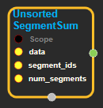
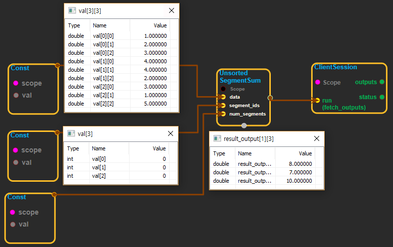

--- 
layout: default 
title: UnsortedSegmentSum 
parent: math_ops 
grand_parent: enuSpace-Tensorflow API 
last_modified_date: now 
--- 

# UnsortedSegmentSum

---

## tensorflow C++ API

[tensorflow::ops::SegmentMax](https://www.tensorflow.org/api_docs/cc/class/tensorflow/ops/unsorted-segment-max)

Computes the sum along segments of a tensor.

---

## Summary

Read the section on segmentation for an explanation of segments.

Computes a tensor such that`(output[i] = sum_{j...} data[j...]`where the sum is over tuples`j...`such that`segment_ids[j...] == i`. Unlike[`SegmentSum`](https://www.tensorflow.org/api_docs/cc/class/tensorflow/ops/segment-sum.html#classtensorflow_1_1ops_1_1_segment_sum),`segment_ids`need not be sorted and need not cover all values in the full range of valid values.

If the sum is empty for a given segment ID`i`,`output[i] = 0`.

`num_segments`should equal the number of distinct segment IDs.

Arguments:

* scope: A [Scope](https://www.tensorflow.org/api_docs/cc/class/tensorflow/scope.html#classtensorflow_1_1_scope) object
* segment\_ids: A tensor whose shape is a prefix of`data.shape`.

Returns:

* [`Output`](https://www.tensorflow.org/api_docs/cc/class/tensorflow/output.html#classtensorflow_1_1_output): Has same shape as data, except for the first`segment_ids.rank`dimensions, which are replaced with a single dimension which has size`num_segments`.

Constructor

* UnsortedSegmentSum\(const ::tensorflow::Scope & scope, ::tensorflow::Input data, ::tensorflow::Input segment\_ids, ::tensorflow::Input num\_segments\) 

Public attributes

* tensorflow::Output output.

---

## UnsortedSegmentSum block

Source link : [https://github.com/EXPNUNI/enuSpaceTensorflow/blob/master/enuSpaceTensorflow/tf\_math.cpp](https://github.com/EXPNUNI/enuSpaceTensorflow/blob/master/enuSpaceTensorflow/tf_math.cpp)

Argument:

* Scope scope : A Scope object \(A scope is generated automatically each page. A scope is not connected.\).
* Input data:connect  Input node.
* Input segment\_ids:connect  Input node.
* Input num\_segments : connect  Input node.

Return:

* Output output: Output object of UnsortedSegmentSum class object.

Result:

* std::vector\(Tensor\) product\_result : Returned object of executed result by calling session.

---

## Using Method

