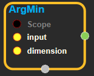
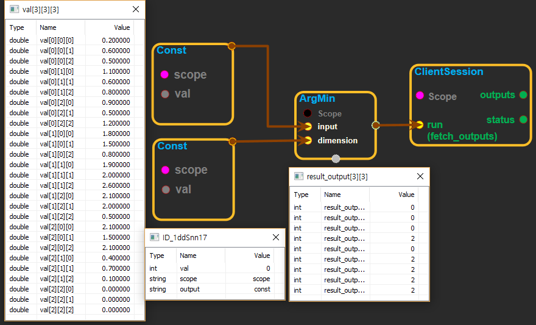
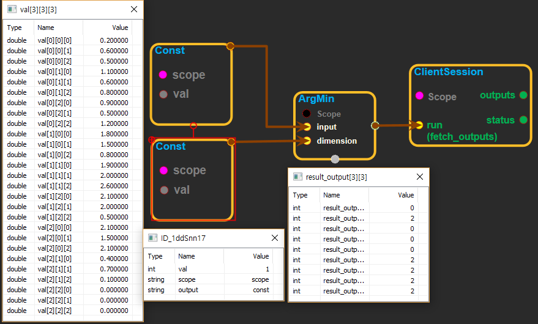

--- 
layout: default 
title: ArgMin 
parent: math_ops 
grand_parent: enuSpace-Tensorflow API 
last_modified_date: now 
--- 

# ArgMin

---

## tensorflow C++ API

[tensorflow::ops::ArgMin](https://www.tensorflow.org/api_docs/cc/class/tensorflow/ops/arg-min)

Returns the index with the smallest value across dimensions of a tensor.

---

## Summary

Note that in case of ties the identity of the return value is not guaranteed.

Arguments:

* scope: A [Scope](https://www.tensorflow.org/api_docs/cc/class/tensorflow/scope.html#classtensorflow_1_1_scope) object
* dimension: int32, 0 &lt;= dimension &lt; rank\(input\). Describes which dimension of the input [Tensor](https://www.tensorflow.org/api_docs/cc/class/tensorflow/tensor.html#classtensorflow_1_1_tensor) to reduce across. For vectors, use dimension = 0.

Returns:

* [`Output`](https://www.tensorflow.org/api_docs/cc/class/tensorflow/output.html#classtensorflow_1_1_output): The output tensor.

Constructor

* ArgMin\(const ::tensorflow::Scope & scope, ::tensorflow::Input input,::tensorflow::Input dimension\).

Public attributes

* tensorflow::Output output.

---

## ArgMin

Source link : [https://github.com/EXPNUNI/enuSpaceTensorflow/blob/master/enuSpaceTensorflow/tf\_math.cpp](https://github.com/EXPNUNI/enuSpaceTensorflow/blob/master/enuSpaceTensorflow/tf_math.cpp)

Argument:

* Scope scope : A Scope object \(A scope is generated automatically each page. A scope is not connected.\).
* Input input: connect  Input node.
* Input dimension: connect  Input node.

Return:

* Output output: Output object of ArgMin class object.

Result:

* std::vector\(Tensor\) product\_result : Returned object of executed result by calling session.

---

## Using Method

