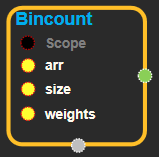
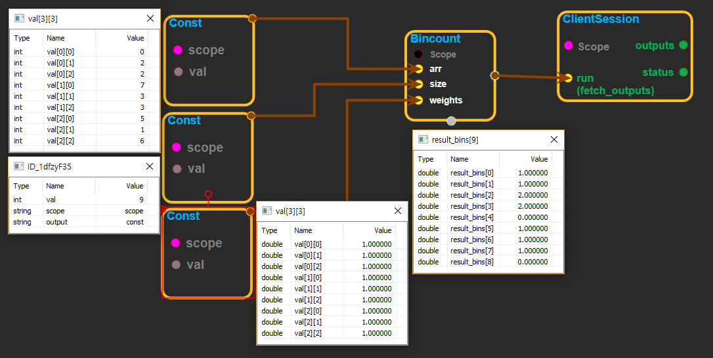

--- 
layout: default 
title: Betainc 
parent: math_ops 
grand_parent: enuSpace-Tensorflow API 
last_modified_date: now 
--- 

# Betainc

---

## tensorflow C++ API

[tensorflow::ops::Bincount](https://www.tensorflow.org/api_docs/cc/class/tensorflow/ops/bincount)

Counts the number of occurrences of each value in an integer array.

---

## Summary

Outputs a vector with length`size`and the same dtype as`weights`. If`weights`are empty, then index`i`stores the number of times the value`i`is counted in`arr`. If`weights`are non-empty, then index`i`stores the sum of the value in`weights`at each index where the corresponding value in`arr`is`i`.

Values in`arr`outside of the range \[0, size\) are ignored.

Arguments:

* scope: A [Scope](https://www.tensorflow.org/api_docs/cc/class/tensorflow/scope.html#classtensorflow_1_1_scope) object
* arr: int32[`Tensor`](https://www.tensorflow.org/api_docs/cc/class/tensorflow/tensor.html#classtensorflow_1_1_tensor).
* size: non-negative int32 scalar[`Tensor`](https://www.tensorflow.org/api_docs/cc/class/tensorflow/tensor.html#classtensorflow_1_1_tensor).
* weights: is an int32, int64, float32, or float64[`Tensor`](https://www.tensorflow.org/api_docs/cc/class/tensorflow/tensor.html#classtensorflow_1_1_tensor)with the same shape as`arr`, or a length-0[`Tensor`](https://www.tensorflow.org/api_docs/cc/class/tensorflow/tensor.html#classtensorflow_1_1_tensor), in which case it acts as all weights equal to 1.

Returns:

* [`Output`](https://www.tensorflow.org/api_docs/cc/class/tensorflow/output.html#classtensorflow_1_1_output): 1D[`Tensor`](https://www.tensorflow.org/api_docs/cc/class/tensorflow/tensor.html#classtensorflow_1_1_tensor)with length equal to`size`. The counts or summed weights for each value in the range \[0, size\).

Constructor

* Bincount\(const ::tensorflow::Scope & scope, ::tensorflow::Input a, ::tensorflow::Input b, ::tensorflow::Input x\).

Public attributes

* tensorflow::Output z.

---

## Bincount block

Source link : [https://github.com/EXPNUNI/enuSpaceTensorflow/blob/master/enuSpaceTensorflow/tf\_math.cpp](https://github.com/EXPNUNI/enuSpaceTensorflow/blob/master/enuSpaceTensorflow/tf_math.cpp)

Argument:

* Scope scope : A Scope object \(A scope is generated automatically each page. A scope is not connected.\).
* Input arr :connect  Input node.
* Input size :connect  Input node.
* Input weights :connect  Input node.

Return:

* Output z : Output object of Bincount class object.

Result:

* std::vector\(Tensor\) product\_result : Returned object of executed result by calling session.

---

## Using Method

