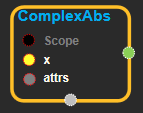
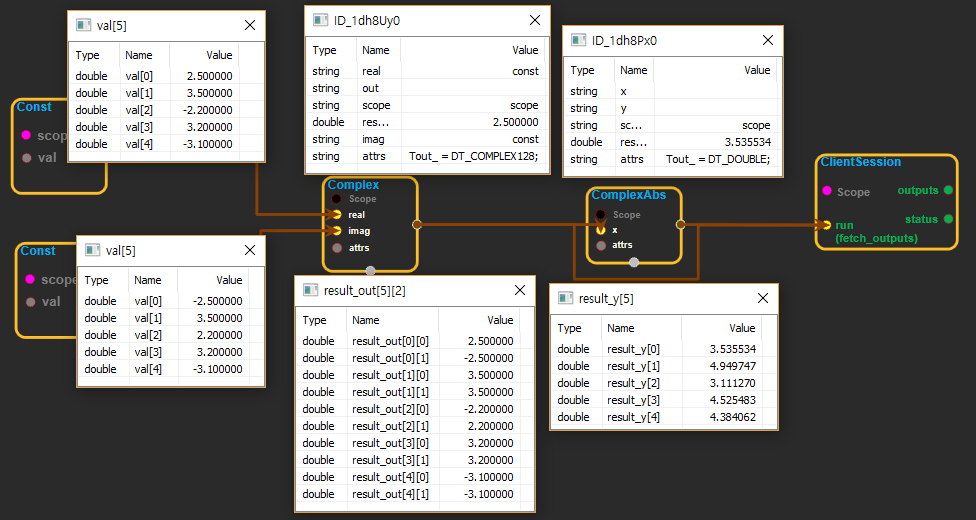

--- 
layout: default 
title: ComplexAbs 
parent: math_ops 
grand_parent: enuSpace-Tensorflow API 
last_modified_date: now 
--- 

# ComplexAbs

---

## tensorflow C++ API

[tensorflow::ops::ComplexAbs](https://www.tensorflow.org/api_docs/cc/class/tensorflow/ops/complex-abs)

Computes the complex absolute value of a tensor.

---

## Summary

Given a tensor`x`of complex numbers, this operation returns a tensor of type`float`or`double`that is the absolute value of each element in`x`.[All](https://www.tensorflow.org/api_docs/cc/class/tensorflow/ops/all.html#classtensorflow_1_1ops_1_1_all) elements in`x`must be complex numbers of the form \(a + bj\). The absolute value is computed as sqrt\( {a^2 + b^2}\).

Arguments:

* scope: A [Scope](https://www.tensorflow.org/api_docs/cc/class/tensorflow/scope.html#classtensorflow_1_1_scope) object

Returns:

* [`Output`](https://www.tensorflow.org/api_docs/cc/class/tensorflow/output.html#classtensorflow_1_1_output): The y tensor.

Constructor

* ComplexAbs\(const ::tensorflow::Scope & scope, ::tensorflow::Input x, const ComplexAbs::Attrs attrs\).

Public attributes

* tensorflow::Output y.

---

## ComplexAbs block

Source link : [https://github.com/EXPNUNI/enuSpaceTensorflow/blob/master/enuSpaceTensorflow/tf\_math.cpp](https://github.com/EXPNUNI/enuSpaceTensorflow/blob/master/enuSpaceTensorflow/tf_math.cpp)

Argument:

* Scope scope : A Scope object \(A scope is generated automatically each page. A scope is not connected.\).
* Input x:connect  Input node.
* Complex::Attrs attrs:Input DatType in value. ex\) Tout\_=DT\_FLOAT_,  Tout\__=\_DT\_DOUBLE

Return:

* Output y : Output object of ComplexAbs class object.

Result:

* std::vector\(Tensor\) product\_result : Returned object of executed result by calling session.

---

## Using Method

