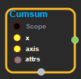
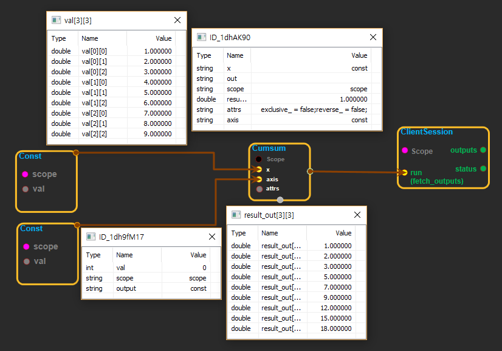

--- 
layout: default 
title: Cumsum 
parent: math_ops 
grand_parent: enuSpace-Tensorflow API 
last_modified_date: now 
--- 

# Cumsum

---

## tensorflow C++ API

[tensorflow::ops::Cumsum](https://www.tensorflow.org/api_docs/cc/class/tensorflow/ops/cumsum)

Compute the cumulative sum of the tensor`x`along`axis`.

---

## Summary

By default, this op performs an inclusive cumsum, which means that the first element of the input is identical to the first element of the output: \`\`\`prettyprint tf.cumsum\(\[a, b, c\]\) ==&gt; \[a, a + b, a + b + c\] \`\`\`

By setting the`exclusive`kwarg to`True`, an exclusive cumsum is performed instead: \`\`\`prettyprint tf.cumsum\(\[a, b, c\], exclusive=True\) ==&gt; \[0, a, a + b\] \`\`\`

By setting the`reverse`kwarg to`True`, the cumsum is performed in the opposite direction: \`\`\`prettyprint tf.cumsum\(\[a, b, c\], reverse=True\) ==&gt; \[a + b + c, b + c, c\] \`\``This is more efficient than using separate`tf.reverse\` ops.

The`reverse`and`exclusive`kwargs can also be combined: \`\`\`prettyprint tf.cumsum\(\[a, b, c\], exclusive=True, reverse=True\) ==&gt; \[b + c, c, 0\] \`\`\`

Arguments:

* scope: A [Scope](https://www.tensorflow.org/api_docs/cc/class/tensorflow/scope.html#classtensorflow_1_1_scope) object

Returns:

* [`Output`](https://www.tensorflow.org/api_docs/cc/class/tensorflow/output.html#classtensorflow_1_1_output): The out tensor.

Constructor

* Cumsum\(const ::tensorflow::Scope & scope, ::tensorflow::Input x, ::tensorflow::Input axis, const
  [Cumprod::Attrs](https://www.tensorflow.org/api_docs/cc/struct/tensorflow/ops/cumprod/attrs.html#structtensorflow_1_1ops_1_1_cumprod_1_1_attrs) & attrs\).

Public attributes

* tensorflow::Output out.

---

## Cumsum block

Source link : [https://github.com/EXPNUNI/enuSpaceTensorflow/blob/master/enuSpaceTensorflow/tf\_math.cpp](https://github.com/EXPNUNI/enuSpaceTensorflow/blob/master/enuSpaceTensorflow/tf_math.cpp)

Argument:

* Scope scope : A Scope object \(A scope is generated automatically each page. A scope is not connected.\).
* Input x:connect  Input node.
* Input axis:connect  Input node. ex\) 0 or 1.
* Cumsum ::Attrs attrs:Input attrs  in value. ex\) exclusive\_ = false_; reverse\__ =false;

Return:

* Output out: Output object of Cumsum class object.

Result:

* std::vector\(Tensor\) product\_result : Returned object of executed result by calling session.

---

## Using Method

