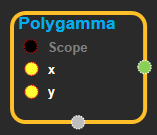
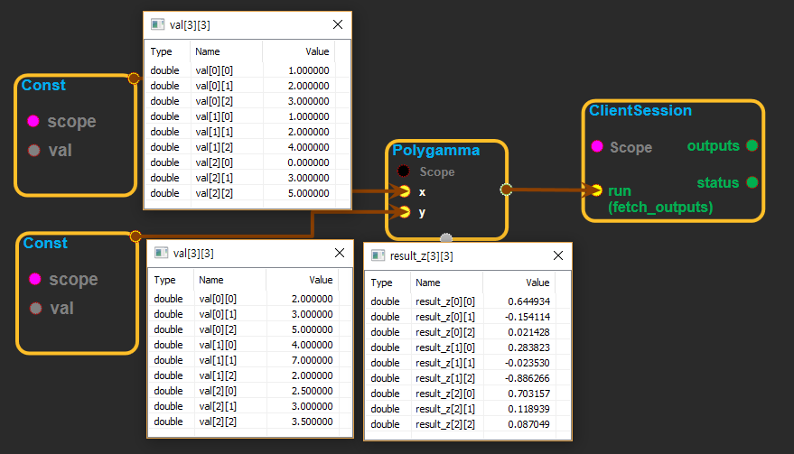

--- 
layout: default 
title: Polygamma 
parent: math_ops 
grand_parent: enuSpace-Tensorflow API 
last_modified_date: now 
--- 

# Polygamma

---

## tensorflow C++ API

[tensorflow::ops::Polygamma](https://www.tensorflow.org/api_docs/cc/class/tensorflow/ops/polygamma)

Compute the polygamma function ^{\(n\)}\(x\).

---

## Summary

The polygamma function is defined as:

^{\(n\)}\(x\) = {d^n}{dx^n} \(x\)

where \(x\) is the digamma function.

Arguments:

* scope: A [Scope](https://www.tensorflow.org/api_docs/cc/class/tensorflow/scope.html#classtensorflow_1_1_scope) object

Returns:

* [`Output`](https://www.tensorflow.org/api_docs/cc/class/tensorflow/output.html#classtensorflow_1_1_output): The z tensor.

Constructor

* Polygamma\(const ::tensorflow::Scope & scope,  ::tensorflow::Input x,  ::tensorflow::Input y\).

Public attributes

* tensorflow::Output z.

---

## Polygamma block

Source link : [https://github.com/EXPNUNI/enuSpaceTensorflow/blob/master/enuSpaceTensorflow/tf\_math.cpp](https://github.com/EXPNUNI/enuSpaceTensorflow/blob/master/enuSpaceTensorflow/tf_math.cpp)

Argument:

* Scope scope : A Scope object \(A scope is generated automatically each page. A scope is not connected.\).
* Input x:connect  Input node.
* Input y:connect  Input node.

Return:

* Output z: Output object of Polygamma class object.

Result:

* std::vector\(Tensor\) product\_result : Returned object of executed result by calling session.

---

## Using Method

