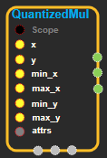

--- 
layout: default 
title: QuantizedMul 
parent: math_ops 
grand_parent: enuSpace-Tensorflow API 
last_modified_date: now 
--- 

# QuantizedMul

---

## tensorflow C++ API

[tensorflow::ops::QuantizedMul](https://www.tensorflow.org/api_docs/cc/class/tensorflow/ops/quantized-mul)

Returns x \* y element-wise, working on quantized buffers.

---

## Summary

Arguments:

* scope: A [Scope](https://www.tensorflow.org/api_docs/cc/class/tensorflow/scope.html#classtensorflow_1_1_scope) object
* min\_x: The float value that the lowest quantized`x`value represents.
* max\_x: The float value that the highest quantized`x`value represents.
* min\_y: The float value that the lowest quantized`y`value represents.
* max\_y: The float value that the highest quantized`y`value represents.

Output

* output  z
* output  min\_z: The float value that the lowest quantized output value represents.
* output : max\_z: The float value that the highest quantized output value represents.

NOTE[`QuantizedMul`](https://www.tensorflow.org/api_docs/cc/class/tensorflow/ops/quantized-mul.html#classtensorflow_1_1ops_1_1_quantized_mul)supports limited forms of broadcasting. More about broadcasting [here](http://docs.scipy.org/doc/numpy/user/basics.broadcasting.html)

Constructor

* QuantizedMul\(const ::tensorflow::Scope & scope, ::tensorflow::Input x, ::tensorflow::Input y, ::tensorflow::Input min\_x, ::tensorflow::Input max\_x, ::tensorflow::Input min\_y, ::tensorflow::Input max\_y, const QuantizedMul::Attrs & attrs\)

Public attributes

* tensorflow::Output z.
* tensorflow::Output min\_z.
* tensorflow::Output max\_z.

---

## QuantizedMul block

Source link : [https://github.com/EXPNUNI/enuSpaceTensorflow/blob/master/enuSpaceTensorflow/tf\_math.cpp](https://github.com/EXPNUNI/enuSpaceTensorflow/blob/master/enuSpaceTensorflow/tf_math.cpp)

Argument:

* Scope scope : A Scope object \(A scope is generated automatically each page. A scope is not connected.\).
* Input x : connect  Input node.
* Input y : connect  Input node.
* Input min\_x : connect  Input node.
* Input max\_x : connect  Input node.
* Input min\_y : connect  Input node.
* Input max\_y : connect  Input node.
* DataType out\_type:Input DataType. ex\)DT\_QINT8

Return:

* Output output: Output object of QuantizedMul class object.

Result:

* std::vector\(Tensor\) product\_result : Returned object of executed result by calling session.

---

## Using Method

tensorflow -&gt; error: No OpKernel was registered to support Op 'QuantizedMul' with these attrs.

Registered devices: \[CPU,GPU\], Registered kernels:

&lt;no registered kernels&gt;

