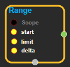
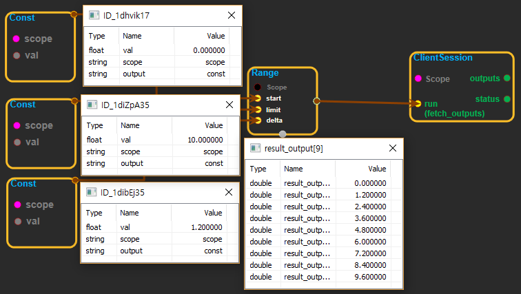

--- 
layout: default 
title: Range 
parent: math_ops 
grand_parent: enuSpace-Tensorflow API 
last_modified_date: now 
--- 

# Range

---

## tensorflow C++ API

[tensorflow::ops::Range](https://www.tensorflow.org/api_docs/cc/class/tensorflow/ops/range)

Creates a sequence of numbers.

---

## Summary

This operation creates a sequence of numbers that begins at`start`and extends by increments of`delta`up to but not including`limit`.

For example:

\`\`\` 'start' is 3

'limit' is 18

'delta' is 3

tf.range\(start, limit, delta\) ==&gt; \[3, 6, 9, 12, 15\] \`\`\`

Arguments:

* scope: A [Scope](https://www.tensorflow.org/api_docs/cc/class/tensorflow/scope.html#classtensorflow_1_1_scope) object
* start: 0-D \(scalar\). First entry in the sequence.
* limit: 0-D \(scalar\). Upper limit of sequence, exclusive.
* delta: 0-D \(scalar\). Optional. Default is 1. Number that increments `start`.

Output

* output : 1-D.

Constructor

* Range\(const ::tensorflow::Scope & scope, ::tensorflow::Input start, ::tensorflow::Input limit, ::tensorflow::Input delta\)

Public attributes

* tensorflow::Output output.

---

## Range block

Source link : [https://github.com/EXPNUNI/enuSpaceTensorflow/blob/master/enuSpaceTensorflow/tf\_math.cpp](https://github.com/EXPNUNI/enuSpaceTensorflow/blob/master/enuSpaceTensorflow/tf_math.cpp)

Argument:

* Scope scope : A Scope object \(A scope is generated automatically each page. A scope is not connected.\).
* Input start:connect  Input node.
* Input limit:connect  Input node.
* Input delta:connect  Input node.

Return:

* Output output: Output object of Range class object.

Result:

* std::vector\(Tensor\) product\_result : Returned object of executed result by calling session.

---

## Using Method

