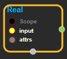
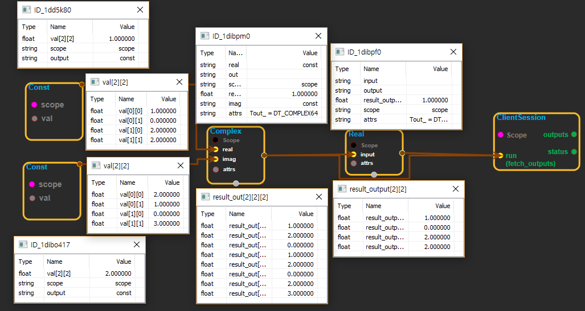

--- 
layout: default 
title: Real 
parent: math_ops 
grand_parent: enuSpace-Tensorflow API 
last_modified_date: now 
--- 

# Real

---

## tensorflow C++ API

[tensorflow::ops::Real](https://www.tensorflow.org/api_docs/cc/class/tensorflow/ops/real)

Returns the real part of a complex number.

---

## Summary

Given a tensor`input`of complex numbers, this operation returns a tensor of type`float`that is the real part of each element in`input`.[All](https://www.tensorflow.org/api_docs/cc/class/tensorflow/ops/all.html#classtensorflow_1_1ops_1_1_all) elements in`input`must be complex numbers of the form a + bj, where a is the real part returned by this operation and b is the imaginary part.

For example:

\`\`\` tensor 'input' is \[-2.25 + 4.75j, 3.25 + 5.75j\]

tf.real\(input\) ==&gt; \[-2.25, 3.25\] \`\`\`

Arguments:

* scope: A [Scope](https://www.tensorflow.org/api_docs/cc/class/tensorflow/scope.html#classtensorflow_1_1_scope) object

Returns:

* [`Output`](https://www.tensorflow.org/api_docs/cc/class/tensorflow/output.html#classtensorflow_1_1_output): The output tensor.

Constructor

* Real\(const ::tensorflow::Scope & scope, ::tensorflow::Input input, const Real::Attrs & attrs\) 

Public attributes

* tensorflow::Output output.

---

## Real block

Source link : [https://github.com/EXPNUNI/enuSpaceTensorflow/blob/master/enuSpaceTensorflow/tf\_math.cpp](https://github.com/EXPNUNI/enuSpaceTensorflow/blob/master/enuSpaceTensorflow/tf_math.cpp)

Argument:

* Scope scope : A Scope object \(A scope is generated automatically each page. A scope is not connected.\).
* Input input:connect  Input node.
* Real::Attrs & attrs : Input DataType. ex\)Tout\_ = DT\_FLOAT;

Return:

* Output output : Output object of Real class object.

Result:

* std::vector\(Tensor\) product\_result : Returned object of executed result by calling session.

---

## Using Method

