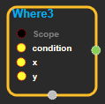
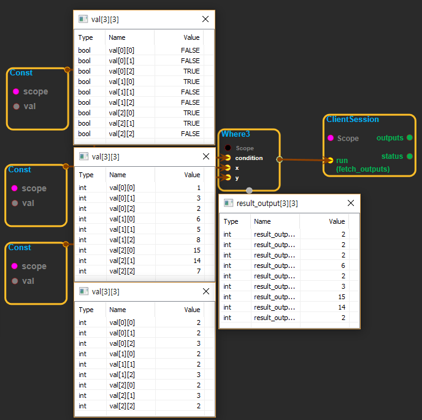

--- 
layout: default 
title: Where3 
parent: math_ops 
grand_parent: enuSpace-Tensorflow API 
last_modified_date: now 
--- 

# Where3

---

## tensorflow C++ API

[tensorflow::ops::Where3](https://www.tensorflow.org/api_docs/cc/class/tensorflow/ops/where3)

Computes the sum along segments of a tensor.

---

## Summary

The`x`, and`y`tensors must all have the same shape, and the output will also have that shape.

The`condition`tensor must be a scalar if`x`and`y`are scalars. If`x`and`y`are vectors or higher rank, then`condition`must be either a scalar, a vector with size matching the first dimension of`x`, or must have the same shape as`x`.

The`condition`tensor acts as a mask that chooses, based on the value at each element, whether the corresponding element / row in the output should be taken from`x`\(if true\) or`y`\(if false\).

If`condition`is a vector and`x`and`y`are higher rank matrices, then it chooses which row \(outer dimension\) to copy from`x`and`y`. If`condition`has the same shape as`x`and`y`, then it chooses which element to copy from`x`and`y`.

For example:

\`\`\`python 'condition' tensor is \[\[True, False\]

\[False, True\]\]

't' is \[\[1, 2\],\[3, 4\]\]

'e' is \[\[5, 6\],\[7, 8\]\]

select\(condition, t, e\) \# =&gt; \[\[1, 6\], \[7, 4\]\]

'condition' tensor is \[True, False\]

't' is \[\[1, 2\],\[3, 4\]\]

'e' is \[\[5, 6\],\[7, 8\]\]

select\(condition, t, e\) ==&gt; \[\[1, 2\], \[7, 8\]\]

\`\`\`

Arguments:

* scope: A [Scope](https://www.tensorflow.org/api_docs/cc/class/tensorflow/scope.html#classtensorflow_1_1_scope) object
* x: = A[`Tensor`](https://www.tensorflow.org/api_docs/cc/class/tensorflow/tensor.html#classtensorflow_1_1_tensor)which may have the same shape as`condition`. If`condition`is rank 1,`x`may have higher rank, but its first dimension must match the size of`condition`.
* y: = A[`Tensor`](https://www.tensorflow.org/api_docs/cc/class/tensorflow/tensor.html#classtensorflow_1_1_tensor)with the same type and shape as`x`.

Returns:

* [`Output`](https://www.tensorflow.org/api_docs/cc/class/tensorflow/output.html#classtensorflow_1_1_output): A[`Tensor`](https://www.tensorflow.org/api_docs/cc/class/tensorflow/tensor.html#classtensorflow_1_1_tensor)with the same type and shape as`x`and`y`.

Constructor

* Where3\(const ::tensorflow::Scope & scope, ::tensorflow::Input condition, ::tensorflow::Input x, ::tensorflow::Input y\) 

Public attributes

* tensorflow::Output output.

---

## Where3 block

Source link : [https://github.com/EXPNUNI/enuSpaceTensorflow/blob/master/enuSpaceTensorflow/tf\_math.cpp](https://github.com/EXPNUNI/enuSpaceTensorflow/blob/master/enuSpaceTensorflow/tf_math.cpp)

Argument:

* Scope scope : A Scope object \(A scope is generated automatically each page. A scope is not connected.\).
* Input condition : connect  Input node.
* Input x : connect  Input node.
* Input y : connect  Input node.

Return:

* Output output: Output object of Where3 class object.

Result:

* std::vector\(Tensor\) product\_result : Returned object of executed result by calling session.

---

## Using Method

