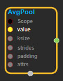
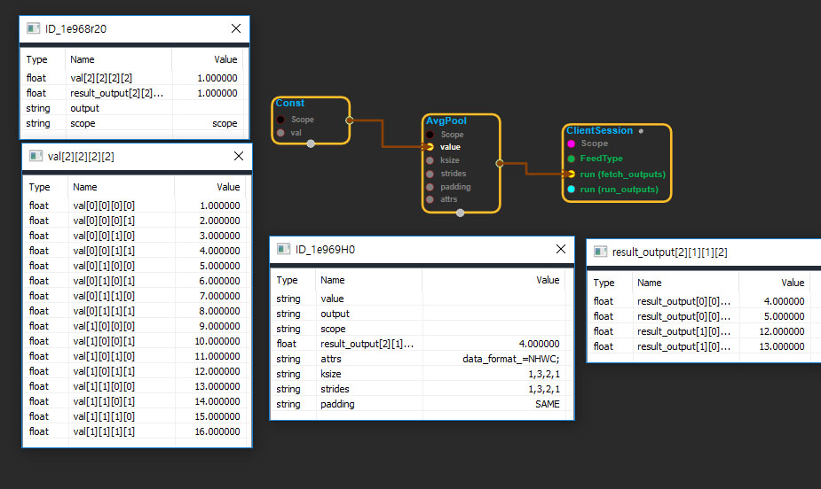

--- 
layout: default 
title: AvgPool 
parent: nn_ops 
grand_parent: enuSpace-Tensorflow API 
last_modified_date: now 
--- 

# AvgPool

---

## tensorflow C++ API 

[tensorflow::ops::AvgPool](https://www.tensorflow.org/api_docs/cc/class/tensorflow/ops/avg-pool)

Performs average pooling on the input.

---

## Summary

Each entry in`output`is the mean of the corresponding size`ksize`window in`value`.

Arguments:

* scope: A [Scope](https://www.tensorflow.org/api_docs/cc/class/tensorflow/scope.html#classtensorflow_1_1_scope) object 
* value: 4-D with shape `[batch, height, width, channels]`.
* ksize: The size of the sliding window for each dimension of `value`.
* strides: The stride of the sliding window for each dimension of`value`.
* padding: The type of padding algorithm to use.

Optional attributes \(see[`Attrs`](https://www.tensorflow.org/api_docs/cc/struct/tensorflow/ops/avg-pool/attrs.html#structtensorflow_1_1ops_1_1_avg_pool_1_1_attrs)\):

* data\_format: Specify the data format of the input and output data. With the default format "NHWC", the data is stored in the order of: \[batch, in\_height, in\_width, in\_channels\]. Alternatively, the format could be "NCHW", the data storage order of: \[batch, in\_channels, in\_height, in\_width\].

Returns:

* [`Output`](https://www.tensorflow.org/api_docs/cc/class/tensorflow/output.html#classtensorflow_1_1_output): The average pooled output tensor.

---

## AvgPool block

Source link : [https://github.com/EXPNUNI/enuSpaceTensorflow/blob/master/enuSpaceTensorflow/tf\_nn.cpp](https://github.com/EXPNUNI/enuSpaceTensorflow/blob/master/enuSpaceTensorflow/tf_random.cpp)

Argument:

* Scope scope : A Scope object \(A scope is generated automatically each page. A scope is not connected.\)
* Input input: connect  Input node.
* ArraySlice&lt; int&gt; ksize: input ksize in values. ex\)1,1,1,1
* ArraySlice&lt; int&gt; strides: input ksize in values. ex\)1,3,2,1
* stringpiece padding: input padding in value. ex\)SAME
* AvgPool ::Attrs attrs: input attrs in values \)data\_format\_ = NHWC;

Return:

* Output output : Output object of AvgPool class object.

Result:

* std::vector\(Tensor\) _result\_output_ : Returned object of executed result by calling session.

---

## Using Method

