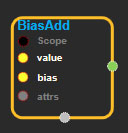
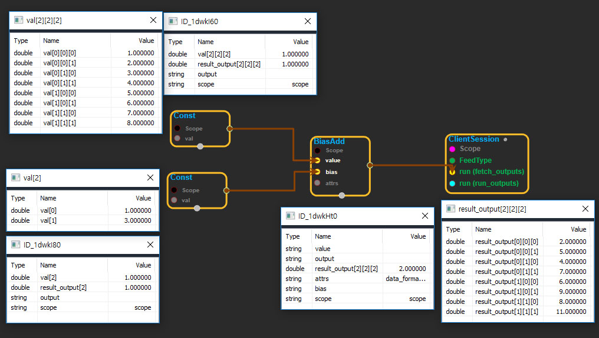

--- 
layout: default 
title: BiasAdd 
parent: nn_ops 
grand_parent: enuSpace-Tensorflow API 
last_modified_date: now 
--- 

# BiasAdd

---

## tensorflow C++ API

[tensorflow::ops::BiasAdd](https://www.tensorflow.org/api_docs/cc/class/tensorflow/ops/bias-add)

Adds`bias`to`value`.

---

## Summary

This is a special case of`tf.add`where`bias`is restricted to be 1-D. Broadcasting is supported, so`value`may have any number of dimensions.

Arguments:

* scope: A [Scope](https://www.tensorflow.org/api_docs/cc/class/tensorflow/scope.html#classtensorflow_1_1_scope) objectA
* value:[Any](https://www.tensorflow.org/api_docs/cc/class/tensorflow/ops/any.html#classtensorflow_1_1ops_1_1_any) number of dimensions.
* bias: 1-D with size the last dimension of`value`.

Optional attributes \(see[`Attrs`](https://www.tensorflow.org/api_docs/cc/struct/tensorflow/ops/bias-add/attrs.html#structtensorflow_1_1ops_1_1_bias_add_1_1_attrs)\):

* data\_format: Specify the data format of the input and output data. With the default format "NHWC", the bias tensor will be added to the last dimension of the value tensor. Alternatively, the format could be "NCHW", the data storage order of: \[batch, in\_channels, in\_height, in\_width\]. The tensor will be added to "in\_channels", the third-to-the-last dimension.

Returns:

* [`Output`](https://www.tensorflow.org/api_docs/cc/class/tensorflow/output.html#classtensorflow_1_1_output): Broadcasted sum of`value`and`bias`.

---

## BiasAdd block

Source link : [https://github.com/EXPNUNI/enuSpaceTensorflow/blob/master/enuSpaceTensorflow/tf\_nn.cpp](https://github.com/EXPNUNI/enuSpaceTensorflow/blob/master/enuSpaceTensorflow/tf_random.cpp)

Argument:

* Scope scope : A Scope object \(A scope is generated automatically each page. A scope is not connected.\)
* Input value: connect  Input node.
* Input bias: connect  Input node.
* BiasAdd ::Attrs attrs : Input attrs in value. ex\) data\_format\_ = NHWC;

Return:

* Output output : Output object of BiasAdd  class object.

Result:

* std::vector\(Tensor\) _result\_output_ : Returned object of executed result by calling session.

---

## Using Method

