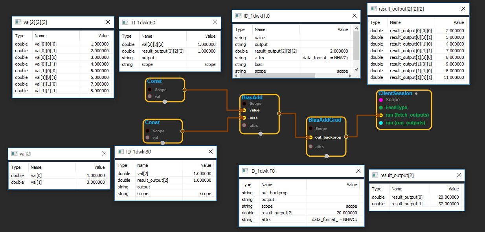

--- 
layout: default 
title: BiasAddGrad 
parent: nn_ops 
grand_parent: enuSpace-Tensorflow API 
last_modified_date: now 
--- 

# BiasAddGrad

---

## tensorflow C++ API

[tensorflow::ops::BiasAddGrad](https://www.tensorflow.org/api_docs/cc/class/tensorflow/ops/bias-add-grad)

Adds`bias`to`value`.

---

## Summary

It accumulates all the values from out\_backprop into the feature dimension. For NHWC data format, the feature dimension is the last. For NCHW data format, the feature dimension is the third-to-last.

Arguments:

* scope: A [Scope](https://www.tensorflow.org/api_docs/cc/class/tensorflow/scope.html#classtensorflow_1_1_scope) object
* out\_backprop: [Any](https://www.tensorflow.org/api_docs/cc/class/tensorflow/ops/any.html#classtensorflow_1_1ops_1_1_any) number of dimensions.

Optional attributes \(see[`Attrs`](https://www.tensorflow.org/api_docs/cc/struct/tensorflow/ops/bias-add-grad/attrs.html#structtensorflow_1_1ops_1_1_bias_add_grad_1_1_attrs)\):

* data\_format: Specify the data format of the input and output data. With the default format "NHWC", the bias tensor will be added to the last dimension of the value tensor. Alternatively, the format could be "NCHW", the data storage order of: \[batch, in\_channels, in\_height, in\_width\]. The tensor will be added to "in\_channels", the third-to-the-last dimension.

Returns:

* [`Output`](https://www.tensorflow.org/api_docs/cc/class/tensorflow/output.html#classtensorflow_1_1_output): 1-D with size the feature dimension of `out_backprop`.

---

## BiasAddGrad block

Source link : [https://github.com/EXPNUNI/enuSpaceTensorflow/blob/master/enuSpaceTensorflow/tf\_nn.cpp](https://github.com/EXPNUNI/enuSpaceTensorflow/blob/master/enuSpaceTensorflow/tf_random.cpp)

Argument:

* Scope scope : A Scope object \(A scope is generated automatically each page. A scope is not connected.\)
* Input value: connect  Input node.
* Input out\_backprop: connect  Input node.
* BiasAddGrad::Attrs attrs : Input attrs in value. ex\) data\_format\_ = NHWC;

Return:

* Output output : Output object of BiasAddGrad class object.

Result:

* std::vector\(Tensor\) _result\_output_ : Returned object of executed result by calling session.

---

## Using Method

