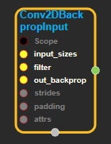
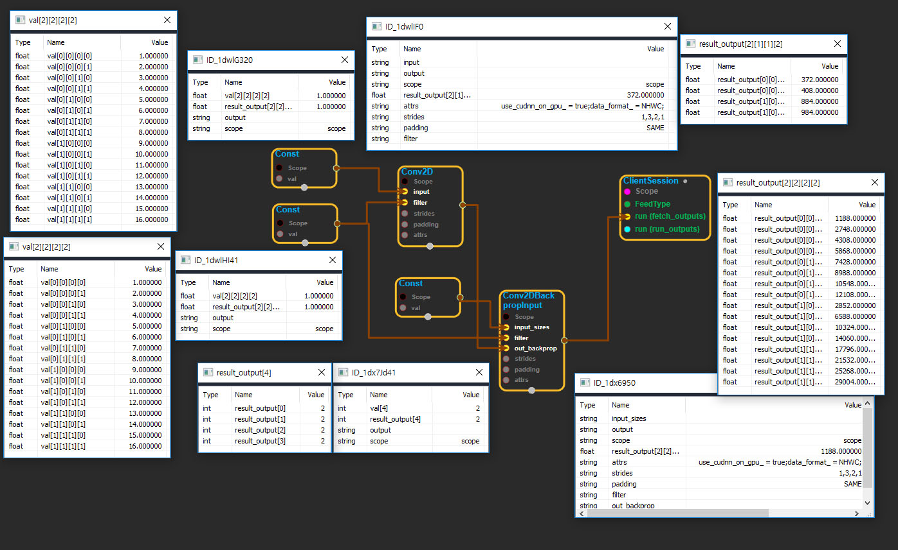

--- 
layout: default 
title: Conv2DBackpropInput 
parent: nn_ops 
grand_parent: enuSpace-Tensorflow API 
last_modified_date: now 
--- 

# Conv2DBackpropInput

---

## tensorflow C++ API

[tensorflow::ops::Conv2DBackpropInput](https://www.tensorflow.org/api_docs/cc/class/tensorflow/ops/conv2-d-backprop-input)

Computes the gradients of convolution with respect to the input.

---

## Summary

Arguments:

* scope: A [Scope](https://www.tensorflow.org/api_docs/cc/class/tensorflow/scope.html#classtensorflow_1_1_scope) Object
* input\_sizes: An integer vector representing the shape of`input`, where`input`is a 4-D`[batch, height, width, channels]`
  tensor.
* filter: 4-D with shape`[filter_height, filter_width, in_channels, out_channels]`.
* out\_backprop: 4-D with shape`[batch, out_height, out_width, out_channels]`. Gradients w.r.t. the output of the convolution.
* strides: The stride of the sliding window for each dimension of the input of the convolution. Must be in the same order as the dimension specified with format.
* padding: The type of padding algorithm to use.

Optional attributes \(see[`Attrs`](https://www.tensorflow.org/api_docs/cc/struct/tensorflow/ops/conv2-d-backprop-input/attrs.html#structtensorflow_1_1ops_1_1_conv2_d_backprop_input_1_1_attrs)\):

* data\_format: Specify the data format of the input and output data. With the default format "NHWC", the data is stored in the order of: \[batch, in\_height, in\_width, in\_channels\]. Alternatively, the format could be "NCHW", the data storage order of: \[batch, in\_channels, in\_height, in\_width\].

Returns:

* [`Output`](https://www.tensorflow.org/api_docs/cc/class/tensorflow/output.html#classtensorflow_1_1_output): 4-D with shape`[batch, in_height, in_width, in_channels]`. Gradient w.r.t. the input of the convolution.

---

## Conv2DBackpropInput block

Source link : [https://github.com/EXPNUNI/enuSpaceTensorflow/blob/master/enuSpaceTensorflow/tf\_nn.cpp](https://github.com/EXPNUNI/enuSpaceTensorflow/blob/master/enuSpaceTensorflow/tf_random.cpp)

Argument:

* Scope scope : A Scope object \(A scope is generated automatically each page. A scope is not connected.\)
* Input input\_sizes: connect  Input node.
* Input filter: connect  Input node.
* Input out\_backprop: connect  Input node.
* gtl::ArraySlice&lt; int &gt; strides: Input strides in value ex\)1,2,2,1
* StringPiece padding: Input paddingin value ex\)SAME
* Conv2DBackpropInput ::Attrs attrs : Input attrs in value. ex\) use\_cudnn\_on\_gpu\_ = true;data\_format\_ = NHWC;

Return:

* Output output : Output object of Conv2DBackpropInput class object.

Result:

* std::vector\(Tensor\) _result\_output_ : Returned object of executed result by calling session.

---

## Using Method

