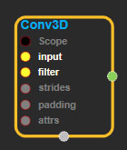
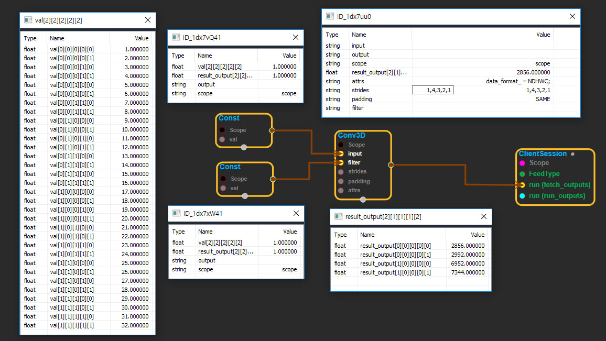

--- 
layout: default 
title: Conv3D 
parent: nn_ops 
grand_parent: enuSpace-Tensorflow API 
last_modified_date: now 
--- 

# Conv3D

---

## tensorflow C++ API

[tensorflow::ops::Conv3D](https://www.tensorflow.org/api_docs/cc/class/tensorflow/ops/conv3-d)

Computes a 3-D convolution given 5-D`input`and`filter`tensors.

---

## Summary

In signal processing, cross-correlation is a measure of similarity of two waveforms as a function of a time-lag applied to one of them. This is also known as a sliding dot product or sliding inner-product.

Our[Conv3D](https://www.tensorflow.org/api_docs/cc/class/tensorflow/ops/conv3-d.html#classtensorflow_1_1ops_1_1_conv3_d)implements a form of cross-correlation.

Arguments:

* scope: A [Scope](https://www.tensorflow.org/api_docs/cc/class/tensorflow/scope.html#classtensorflow_1_1_scope) object
* input:[Shape](https://www.tensorflow.org/api_docs/cc/class/tensorflow/ops/shape.html#classtensorflow_1_1ops_1_1_shape)`[batch, in_depth, in_height, in_width, in_channels]`.
* filter:[Shape](https://www.tensorflow.org/api_docs/cc/class/tensorflow/ops/shape.html#classtensorflow_1_1ops_1_1_shape)`[filter_depth, filter_height, filter_width, in_channels, out_channels]`.`in_channels`must match between`input`and`filter`.
* strides: 1-D tensor of length 5. The stride of the sliding window for each dimension of`input`. Must have`strides[0] = strides[4] = 1`.
* padding: The type of padding algorithm to use.

Optional attributes \(see[`Attrs`](https://www.tensorflow.org/api_docs/cc/struct/tensorflow/ops/conv3-d/attrs.html#structtensorflow_1_1ops_1_1_conv3_d_1_1_attrs)\):

* data\_format: The data format of the input and output data. With the default format "NDHWC", the data is stored in the order of: \[batch, in\_depth, in\_height, in\_width, in\_channels\]. Alternatively, the format could be "NCDHW", the data storage order is: \[batch, in\_channels, in\_depth, in\_height, in\_width\].

Returns:

* [`Output`](https://www.tensorflow.org/api_docs/cc/class/tensorflow/output.html#classtensorflow_1_1_output): The output tensor.

---

## Conv3D block

Source link : [https://github.com/EXPNUNI/enuSpaceTensorflow/blob/master/enuSpaceTensorflow/tf\_nn.cpp](https://github.com/EXPNUNI/enuSpaceTensorflow/blob/master/enuSpaceTensorflow/tf_random.cpp)

Argument:

* Scope scope : A Scope object \(A scope is generated automatically each page. A scope is not connected.\)
* Input input: connect  Input node.
* Input filter: connect  Input node.
* gtl::ArraySlice&lt; int &gt; strides: Input strides in value ex\)1,2,2,1,1
* StringPiece padding: Input paddingin value ex\)SAME
* Conv2D ::Attrs attrs : Input attrs in value. ex\) data\_format\_ = NDHWC;

Return:

* Output output : Output object of Conv3D class object.

Result:

* std::vector\(Tensor\) _result\_output_ : Returned object of executed result by calling session.

---

## Using Method

